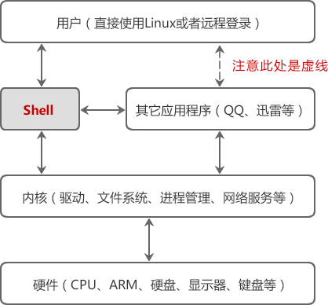

# Shell是什么？1分钟理解Shell的概念！

不论是图形界面还是命令行，想要达到的目的是一样的，都是让用户控制计算机。然而，实际能够控制计算机硬件（CPU、内存、显示器等）的只有操作系统内核（Kernel），
图形界面和命令行只是假设在用户和内核之间的一座桥梁。

由于安全、复杂、繁琐等原因，用户不能直接接触内核（也没有必要），需要另外再开发一个程序，让用户直接使用这个程序；该程序的作用就是接收用户的操作（点击图标、输入命令），
并进行简单的处理，然后再传递给内核，这样用户就能间接地使用操作系统内核了。

用户界面和命令行就是这个另外开发的程序，就是这层“代理”。在Linux下，这个命令行程序叫做 Shell。

**Shell 是一个应用程序，它连接了用户和 Linux 内核，让用户能够更加高效、安全、低成本地使用 Linux 内核，这就是 Shell 的本质。**

Shell 本身并不是内核的一部分，它只是站在内核的基础上编写的一个应用程序，它和 QQ、迅雷、Firefox 等其它软件没有什么区别。然而 Shell 也有着它的特殊性，
**就是开机立马启动，**并呈现在用户面前；用户通过 Shell 来使用 Linux，**不启动 Shell 的话，用户就没办法使用 Linux。**

# Shell 是如何连接用户和内核的？

我们运行一个命令，大部分情况下 Shell 都会去调用内核暴露出来的接口，这就是在使用内核，只是这个过程被 Shell 隐藏了起来，它自己在背后默默进行，我们看不到而已。

接口其实就是一个一个的函数，使用内核就是调用这些函数。这就是使用内核的全部内容了吗？嗯，是的！除了函数，你没有别的途径使用内核。

# Shell 还能连接其它程序
在 Shell 中输入的命令，有一部分是 Shell 本身自带的，这叫做**内置命令**；有一部分是其它的应用程序（一个程序就是一个命令），这叫做**外部命令**。

Shell 本身支持的命令并不多，功能也有限，但是 Shell **可以调用其他的程序**，每个程序就是一个命令，这使得 Shell 命令的数量可以无限扩展

更加惊讶的是，Shell 还可以让多个外部程序发生连接，在它们之间很方便地传递数据，也就是把一个程序的输出结果传递给另一个程序作为输入。

可以将 Shell 在整个 Linux 系统中的地位描述成下图所示的样子。注意“用户”和“其它应用程序”是通过虚线连接的，因为用户启动 Linux 后直接面对的是 Shell，通过 Shell 才能运行其它的应用程序。

# Shell 也支持编程
Shell 虽然没有 C++、Java、Python 等强大，但也支持了基本的编程元素，例如：
+ if...else 选择结构，case...in 开关语句，for、while、until 循环；
+ 变量、数组、字符串、注释、加减乘除、逻辑运算等概念；
+ 函数，包括用户自定义的函数和内置函数（例如 printf、export、eval 等）。

站在这个角度讲，Shell 也是一种编程语言，它的编译器（解释器）是 Shell 这个程序。我们平时所说的 Shell，有时候是指连接用户和内核的这个程序，有时候又是指 Shell 编程。

# Shell 是一种脚本语言
任何代码最终都要被“翻译”成二进制的形式才能在计算机中执行。

有的编程语言，如 C/C++、Pascal、Go语言、汇编等，必须在程序运行之前将所有代码都翻译成二进制形式，也就是生成可执行文件，用户拿到的是最终生成的可执行文件，看不到源码。

这个过程叫做编译（Compile），这样的编程语言叫做编译型语言，完成编译过程的软件叫做编译器（Compiler）。

而有的编程语言，如 Shell、JavaScript、Python、PHP等，需要一边执行一边翻译，不会生成任何可执行文件，用户必须拿到源码才能运行程序。程序运行后会即时翻译，翻译完一部分执行一部分，不用等到所有代码都翻译完。

这个过程叫做解释，这样的编程语言叫做解释型语言或者脚本语言（Script），完成解释过程的软件叫做解释器。

编译型语言的优点是执行速度快、对硬件要求低、保密性好，适合开发操作系统、大型应用程序、数据库等。

脚本语言的优点是使用灵活、部署容易、跨平台性好，非常适合 Web 开发以及小工具的制作。

Shell 就是一种脚本语言，我们编写完源码后不用编译，直接运行源码即可。
