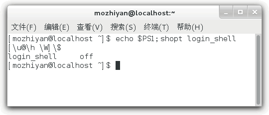

# Shell四种运行方式（启动方式）精讲
Shell 是一个应用程序，它的一端连接着 Linux 内核，另一端连接着用户。Shell 是用户和 Linux 系统沟通的桥梁，我们都是通过 Shell 来管理 Linux 系统。

我们可以直接使用 Shell，也可以输入用户名和密码后再使用 Shell；第一种叫做非登录式，第二种叫做登录式。

我们可以在 Shell 中一个个地输入命令并及时查看它们的输出结果，整个过程都在跟 Shell 不停地互动，这叫做交互式。
我们也可以运行一个 Shell 脚本文件，让所有命令批量化、一次性地执行，这叫做非交互式。

总起来说，Shell 一共有四种运行方式：
+ 交互式的登录Shell
+ 交互式的非登录Shell
+ 非交互式的登录Shell
+ 非交互式的非登录Shell

# 判断Shell是否是交互式

判断是否为交互式 Shell 有两种简单的方法。

1）查看变量`-`的值，如果值中包含了字母`i`，则表示交互式（interactive）。

【实例1】在 CentOS GNOME 桌面环境自带的终端下输出`-`的值：
```shell
[root@zntsa 11.执行Shell脚本]# echo $-
himBH
```
包含了`i`，为交互式。

【实例2】在 Shell 脚本文件中输出`-`的值：
```shell
[root@zntsa 12.Shell四种运行方式（启动方式）]# cat test.sh 
#!/bin/bash
echo $-
[root@zntsa 12.Shell四种运行方式（启动方式）]# sh ./test.sh 
hB
```
不包含`i`，为非交互式。注意，必须在新进程中运行 Shell 脚本。

2)查看变量PS1的值，如果非空，则为交互式，否则为非交互式，因为非交互式会清空该变量。

【实例1】在 CentOS GNOME 桌面环境自带的终端下输出 PS1 的值：
```shell
[root@zntsa 12.Shell四种运行方式（启动方式）]# echo $PS1
[\u@\h \W]\$
```
非空，为交互式。

【实例2】在 Shell 脚本文件中输出 PS1 的值：
```shell
echo $PS1[root@zntsa 12.Shell四种运行方式（启动方式）]# cat test.sh 
#!/bin/bash
echo $PS1
[root@zntsa 12.Shell四种运行方式（启动方式）]# sh test.sh 


```
空值，为非交互式。注意，必须在新进程中运行 Shell 脚本。

# 判断 Shell 是否为登录式
判断 Shell 是否为登录式也非常简单，只需执行`shopt login_shell`即可，值为`on`表示为登录式，`off`为非登录式。

shopt 命令用来查看或设置 Shell 中的行为选项，这些选项可以增强 Shell 的易用性。

【实例1】在 CentOS GNOME 桌面环境自带的终端下查看 login_shell 选项：
```shell
[root@zntsa 12.Shell四种运行方式（启动方式）]# shopt login_shell
login_shell     on

```
【实例2】按下Ctrl+Alt+Fn组合键切换到虚拟终端，输入用户名和密码登录后，再查看 login_shell 选项：
```shell
[c.biancheng.net]$ shopt login_shell
login_shell    on
```
【实例3】在 Shell 脚本文件中查看 login_shel 选项：
```shell
[root@zntsa 12.Shell四种运行方式（启动方式）]# cat test.sh 
#!/bin/bash
shopt login_shell

[root@zntsa 12.Shell四种运行方式（启动方式）]# sh test.sh 
login_shell     off

```
# 同时判断交互式、登录式
要同时判断是否为交互式和登录式，可以简单使用如下的命令：
```shell
echo $PS1;shopt login_shell
```
或者
```shell
echo $-; shopt login_shell
```
# 常见的 Shell 启动方式

1)通过 Linux 控制台（不是桌面环境自带的终端）或者 ssh 登录 Shell 时（这才是正常登录方式），为交互式的登录 Shell。
```shell
[root@zntsa 12.Shell四种运行方式（启动方式）]# echo $PS1;shopt login_shell
[\u@\h \W]\$
login_shell     on
```

2)执行 bash 命令时**默认是非登录**的，增加`--login`选项（简写为`-l`）后变成登录式。
```shell
[root@zntsa 12.Shell四种运行方式（启动方式）]# cat test.sh 
#!/bin/bash
echo $-; shopt login_shell

[root@zntsa 12.Shell四种运行方式（启动方式）]# sh test.sh 
hB
login_shell     off
```

3)使用由()包围的组命令或者命令替换进入子 Shell 时，子 Shell 会继承父 Shell 的交互和登录属性。
```shell
[root@zntsa 12.Shell四种运行方式（启动方式）]# bash
[root@zntsa 12.Shell四种运行方式（启动方式）]# (echo $PS1;shopt login_shell)
[\u@\h \W]\$
login_shell     off
[root@zntsa 12.Shell四种运行方式（启动方式）]# bash -l
[root@zntsa 12.Shell四种运行方式（启动方式）]# (echo $PS1;shopt login_shell)
[\u@\h \W]\$
login_shell     on
```

4)ssh 执行远程命令，但不登录时，为非交互非登录式。
```shell
[root@zntsa 12.Shell四种运行方式（启动方式）]# ssh localhost 'echo $PS1;shopt login_shell'
root@localhost's password: 

login_shell     off
```

5)在 Linux 桌面环境下打开终端时，为交互式的非登录 Shell。

