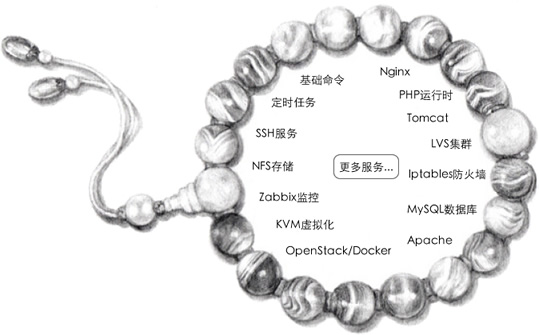

# Shell是运维人员必须掌握的技能

Shell 脚本很适合处理纯文本类型的数据，而 Linux 中几乎所有的配置文件、日志文件（如 NFS、Rsync、Httpd、Nginx、MySQL 等），以及绝大多数的启动文件都是纯文本类型的文件。

下面的手链形象地展示了 Shell 在运维工作中的地位：

运维“手链”的组成：每颗“珍珠”都是一项服务，将珍珠穿起来的“线”就是 Shell。

# Shell、Python 和 Perl

除了 Shell，能够用于 Linux 运维的脚本语言还有 Python 和 Perl。

1) Perl 语言
Perl 比 Shell 强大很多，在 2010 年以前很流行，它的语法灵活、复杂，在实现不同的功能时可以用多种不同的方式，缺点是不易读，团队协作困难。

2) Python 语言
Python 是近几年非常流行的语言，它不但可以用于脚本程序开发，也可以实现 Web 程序开发（知乎、豆瓣、YouTube、Instagram 都是用 Python 开发），甚至还可以实现软件的开发（大名鼎鼎的 OpenStack、SaltStack 都是 Python 语言开发）、游戏开发、大数据开发、移动端开发。 
现在越来越多的公司要求运维人员会 Python 自动化开发，Python 也成了运维人员必备的技能，每一个运维人员在熟悉了 Shell 之后，都应该再学习 Python 语言。

3) Shell
Shell 脚本的优势在于处理偏操作系统底层的业务，例如，Linux 内部的很多应用（有的是应用的一部分）都是使用 Shell 脚本开发的，因为有 1000 多个 Linux 系统命令为它作支撑，特别是 Linux 正则表达式以及三剑客 grep、awk、sed 等命令。

对于一些常见的业务应用，使用 Shell 更符合 Linux 运维简单、易用、高效的三大原则。

Python 语言的优势在于开发复杂的运维软件、Web 页面的管理工具和 Web 业务的开发（例如 CMDB 自动化运维平台、跳板机、批量管理软件 SaltStack、云计算 OpenStack 软件）等。

我们在开发一个应用时，应该根据业务需求，结合不同语言的优势以及自己擅长的语言来选择，扬长避短，从而达到高效开发、易于自己维护的目的。
