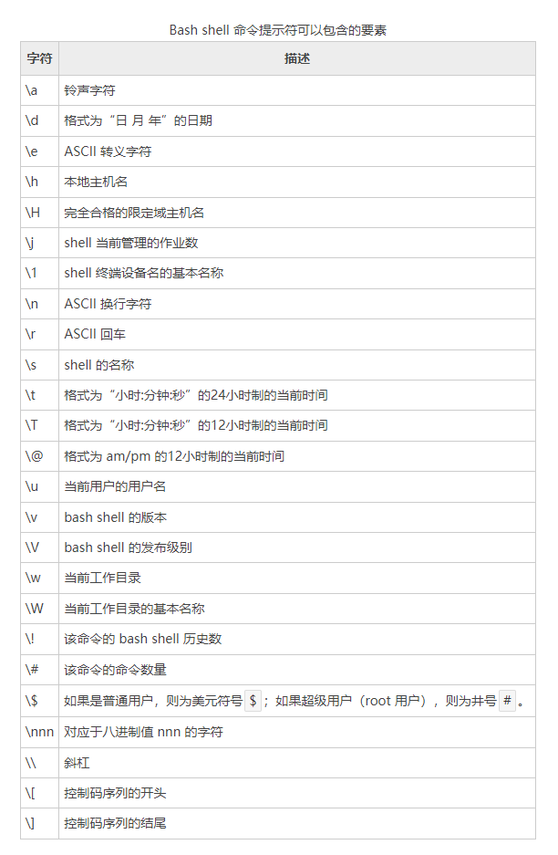

# Shell修改命令提示符
Shell 通过`PS1`和`PS2`这两个环境变量来控制提示符的格式，修改`PS1`和`PS2`的值就能修改命令提示符的格式。
+ PS1控制最外层的命令提示符格式
+ PS2控制第二层的命令提示符格式

在修改 PS1 和 PS2 之前，我们先用 echo 命令输出它们的值，看看默认情况下是什么样子的：
```shell
[root@zntsa ~]# echo $PS1
[\u@\h \W]\$
[root@zntsa ~]# echo $PS2
>
```
Linux 使用以`\`为前导的特殊字符来表示命令提示符中包含的要素，这使得 PS1 和 PS2 的格式看起来可能有点奇怪。
下表展示了可以在 PS1 和 PS2 中使用的特殊字符。



注意，所有的特殊字符均以反斜杠`\`开头，目的是与普通字符区分开来。您可以在命令提示符中使用以上任何特殊字符的组合。

【实例】通过修改 PS1 变量的值来修改命令提示符的格式：
```shell
[root@zntsa ~]# PS1="[\t][\u]\$"
[15:59:13][root]$ll

[15:59:23][root]$PS1="[woshinibaba]\$ "
[woshinibaba]$ 

```
第一次修改后可以显示当前的时间和用户名，第二次修改后显示"我是你爸爸"的拼音。

遗憾的是，**通过这种方式修改的命令提示符只在当前的 Shell 会话期间有效**，再次启动 Shell 后将重新使用默认的命令提示符。

如果希望持久性地修改 PS1，让它对任何 Shell 会话都有效，那么就得把 PS1 变量的修改写入到 Shell 启动文件中。