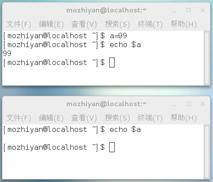
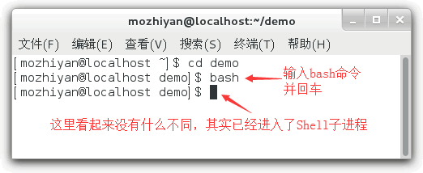
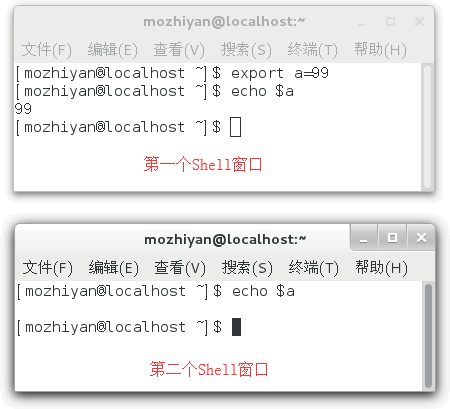

Shell变量的作用域可以分为三种：
+ 有的变量只能在函数内部使用，叫做局部变量（local variable）
+ 有的变量可以在当前Shell进程中使用，叫做全局变量（global variable）
+ 而有的变量还可以在子进程中使用，叫做环境变量（environment variable）

# Shell局部变量
Shell和Java等编程语言不同：在Shell函数中定义的变量，默认也是全局变量，它和在函数外部定义变量拥有一样的效果。
```shell
#!/bin/bash

# 定义函数
function func() {
    a=99
}
# 调用函数
func
# 输出函数内部变量
echo $a
```
运行结果：99，a虽然是在函数内部定义的，但是在函数的外部也能获取的值，证明其作用域是全局的，而不仅限于函数内部。

通过添加`local`命令，可以使得变量变为局部变量。
```shell
#!/bin/bash
# 定义函数
function func() {
    local a=99
}
# 调用函数
func
# 输出函数内部的变量
echo $a
```
输出结果为空，表明变量是一个局部变量。

Shell变量的特性和JavaScript中的变量特性类似。在JavaScript函数中定义的变量，默认也是全局变量，只有加上`var`关键字，它才会变成局部变量。
# Shell全局变量
全局变量，指的是变量在当前的整个Shell进程中都有效。每个Shell进程都有自己的作用域，彼此之间互不影响。**在Shell中定义的变量，默认就是全局变量。**

想展示全局变量在不同Shell进程中的互不关联性，可以在图形界面下同时打开两个Shell，或者使用两个终端远程连接到服务器（SSH）。

首先打开一个 Shell 窗口，定义一个变量 a 并赋值为 99，然后打印，这时在同一个 Shell 窗口中是可正确打印变量 a 的值的。然后再打开一个新的 Shell 窗口，同样打印变量 a 的值，但结果却为空，如图 1 所示。


这说明全局变量 a 仅仅在定义它的第一个 Shell 进程中有效，对新的 Shell 进程没有影响。这很好理解，就像小王家和小徐家都有一部电视机（变量名相同），但是同一时刻小王家和小徐家的电视中播放的节目可以是不同的（变量值不同）。

需要强调的是，全局变量的作用范围是当前的 Shell 进程，而不是当前的 Shell 脚本文件，它们是不同的概念。打开一个 Shell 窗口就创建了一个 Shell 进程，打开多个 Shell 窗口就创建了多个 Shell 进程，每个 Shell 进程都是独立的，拥有不同的进程 ID。在一个 Shell 进程中可以使用 source 命令执行多个 Shell 脚本文件，此时全局变量在这些脚本文件中都有效。

例如，现在有两个Shell脚本文件，分别是a.sh和b.sh

a.sh
```shell
#!/bin/bash
echo $a
b=200
```
b.sh
```shell
#!/bin/bash
echo $b
```
打开一个Shell窗口，执行下面的命令：
下面的命令中，使用`.`后面跟着文件名，意思是在当前进程中运行Shell脚本。
```shell
[c.biancheng.net]$ a=99
[c.biancheng.net]$ . ./a.sh
99
[c.biancheng.net]$ . ./b.sh
200
```
这三条命令都是在一个进程中执行的，从输出结果可以发现，在 Shell 窗口中以命令行的形式定义的变量 a，在 a.sh 中有效；在 a.sh 中定义的变量 b，在 b.sh 中也有效，变量 b 的作用范围已经超越了 a.sh。

# Shell环境变量
全局变量只在当前的Shell进程中有效，对其他Shell和子进程都无效。如果使用`export`命令将全局变量导出，那么它就在所有的子进程中也有效了，这称为“环境变量”。  

环境变量被创建时所处的Shell进程称为父进程，如果在父进程中再创建一个新的进程来执行Shell命令，那么这个新的进程被称为Shell子进程。当Shell子进程产生时，
他会继承父进程的环境变量为自己所用，所以说环境变量可以从父进程传给子进程。不难理解，环境变量还可以传给孙进程。  

注意，两个没有父子关系的Shell进程是不能传递环境变量的，而且环境变量只能从上向下传递，即“传子不传父”

创建Shell子进程最简单的方式是运行bash命令


通过`exit`命令可以一层一层地退出Shell

```shell
[c.biancheng.net]$ a=22       #定义一个全局变量
[c.biancheng.net]$ echo $a    #在当前Shell中输出a，成功
22
[c.biancheng.net]$ bash       #进入Shell子进程
[c.biancheng.net]$ echo $a    #在子进程中输出a，失败

[c.biancheng.net]$ exit       #退出Shell子进程，返回上一级Shell
exit
[c.biancheng.net]$ export a   #将a导出为环境变量
[c.biancheng.net]$ bash       #重新进入Shell子进程
[c.biancheng.net]$ echo $a    #在子进程中再次输出a，成功
22
[c.biancheng.net]$ exit       #退出Shell子进程
exit
[c.biancheng.net]$ exit       #退出父进程，结束整个Shell会话
```
默认情况下，a在Shell子进程中是无效的；使用export将a导出为环境变量之后，在子进程中就可以使用了。

`exprot a`这种形式是在定义变量之后将其导出为环境变量，如果想在定义的同时导出为环境变量，可以写作`export a=22`

环境变量在Shell子进程中有效，但是并不是说它在所有的Shell进程中都有效。比如你用终端又创建个Shell窗口，那么它就是两个不同的Shell进程，环境变量
对于这个新的Shell进程仍然是无效的。


第一个窗口中的环境变量 a 在第二个窗口中就无效。

## 环境变量也是临时的
通过export导出的环境变量只对当前Shell进程及其子进程有效，如果顶层的父进程被关闭了，那么环境变量也就随之消失了，其他的进程也就无法使用了，
所以说环境变量也是临时的。

有读者可能会问，如果我想让一个变量在所有的Shell进程中都有效，不管它们之间是否存在父子关系，那该怎么办呢？

只有将变量写入Shell配置文件中才能达到目的。Shell进程每次启动的时候都会执行配置文件中的一些代码来做一些初始化工作，如果将变量放在配置文件中，
那么每次启动进程都会定义这个变量。