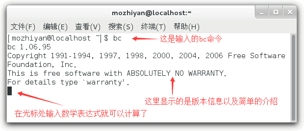
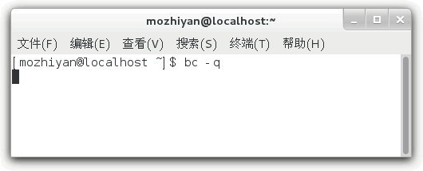
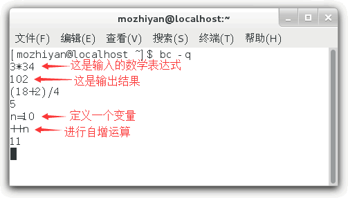
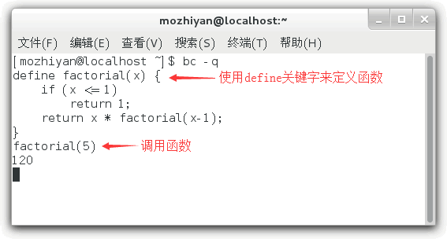
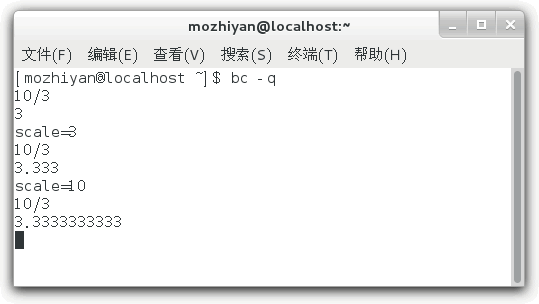
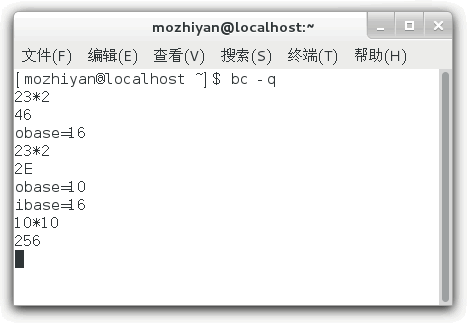
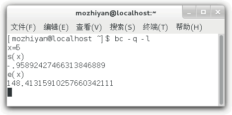
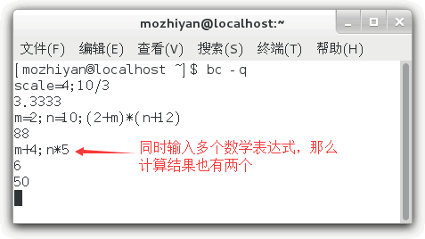

# Linux bc命令：一款数学计算器
Bash Shell 内置了对整数运算的支持，但是并不支持浮点运算，而 Linux bc 命令可以很方便的进行浮点运算，当然整数运算也不再话下。

bc 甚至可以称得上是一种编程语言了，它支持变量、数组、输入输出、分支结构、循环结构、函数等基本的编程元素，所以 Linux 手册中是这样来描述 bc 的：
```shell
An arbitrary precision calculator language
```
翻译过来就是“一个任意精度的计算器语言”。

在终端输入bc命令，然后回车即可进入 bc 进行交互式的数学计算。在 Shell 编程中，我们也可以通过管道和输入重定向来使用 bc。

本节我们先学习如何在交互式环境下使用 bc，然后再学习如何在 Shell 编程中使用 bc，这样就易如反掌了。

# 从终端进入bc
在终端输入 bc 命令，然后回车，就可以进入 bc，请看下图：

bc 命令还有一些选项，可能你会用到，请看下表。

|选项|说明 |
|---|---|
|-h &#124; --help|帮助信息|
|-v &#124; --version	|显示命令版本信息|
|-l &#124; --mathlib	|使用标准数学库|
|-i &#124; --interactive	|强制交互|
|-w &#124; --warn	|显示 POSIX 的警告信息|
|-s &#124; --standard	|使用 POSIX 标准来处理|
|-q &#124; --quiet	|不显示欢迎信息|

例如你不想输入 bc 命令后显示一堆没用的信息，那么可以输入`bc -q`：


# 在交互式环境下使用 bc
使用 bc 进行数学计算是非常容易的，像平常一样输入数学表达式，然后按下回车键就可以看到结果，请看下图。



值得一提的是，我们定义了一个变量 n，然后在计算中也使用了 n，可见 bc 是支持变量的。

除了变量，bc 还支持函数、循环结构、分支结构等常见的编程元素，它们和其它编程语言的语法类似。下面我们定义一个求阶乘的函数：



其实我们很少使用这么复杂的功能，大部分情况下还是把 bc 作为普通的数学计算器，求一下表达式的值而已，所以大家不必深究，了解一下即可。

## 内置变量

bc 有四个内置变量，我们在计算时会经常用到，如下表所示：

|变量名	|作 用 |
|---|---|
|scale|指定精度，也即小数点后的位数；默认为 0，也即不使用小数部分。|
|ibase|指定输入的数字的进制，默认为十进制。|
|obase|指定输出的数字的进制，默认为十进制。|
|last 或者 .	|表示最近打印的数字|

【实例1】scale 变量用法举例：



刚开始的时候，10/3 的值为 3，不带小数部分，就是因为 scale 变量的默认值为 0；后边给 scale 指定了一个大于 0 的值，就能看到小数部分了。

【实例2】ibase 和 obase 变量用法举例：



**注意：obase 要尽量放在 ibase 前面，因为 ibase 设置后，后面的数字都是以 ibase 的进制来换算的。**

## 内置函数
除了内置变量，bc 还有一些内置函数，如下表所示：

|变量名	|作 用 |
|---|---|
|s(x)	|计算 x 的正弦值，x 是弧度值。|
|c(x)|计算 x 的余弦值，x 是弧度值。|
|a(x)	|计算 x 的反正切值，返回弧度值。|
|l(x)	|计算 x 的自然对数。|
|e(x)	|求 e 的 x 次方。|
|j(n, x)|贝塞尔函数，计算从 n 到 x 的阶数。|

要想使用这些数学函数，在输入 bc 命令时需要使用`-l`选项，表示启用数学库。请看下面的例子：



**在一行中使用多个表达式**

在前边的例子中，我们基本上是一行一个表达式，这样看起来更加舒服；如果你愿意，也可以将多个表达式放在一行，只要用分号;隔开就行。请看下面的例子：



# 在Shell中使用bc计算器
在Shell脚本中，我们可以借助管道或者输入重定向来使用bc命令
+ 管道是 Linux 进程间的一种通信机制，它可以将前一个命令（进程）的输出作为下一个命令（进程）的输入，两个命令之间使用竖线|分隔。
+ 通常情况下，一个命令从终端获得用户输入的内容，如果让它从其他地方（比如文件）获得输入，那么就需要重定向。

## 借助管道使用bc计算器
如果读者希望直接输出 bc 的计算结果，那么可以使用下面的形式：
```shell
echo "expression" | bc
```
`expression`就是希望计算的数学表达式，它必须符合 bc 的语法，上面我们已经进行了介绍。在 expression 中，还可以使用 Shell 脚本中的变量。

使用下面的形式可以将 bc 的计算结果赋值给 Shell 变量：
```shell
variable=$(echo "expression" | bc)
```
variable就是变量名

【实例1】最简单的形式：
```shell
[root@vultr ~]# echo "3*8"|bc
24
[root@vultr ~]# ret=$(echo "4*9"|bc)
[root@vultr ~]# echo $ret
36
```
【实例2】使用 bc 中的变量：
```shell
[root@vultr ~]# echo "scale=4;3*8/7"|bc
3.4285
[root@vultr ~]# echo "scale=4;3*8/7;last*5"|bc
3.4285
17.1425
```
【实例3】使用Shell脚本中的变量
```shell
[root@vultr ~]# echo "scale=5;n=$x+2;e(n)"|bc -l
403.42879
```
在第二条命令中，`$x`表示使用第一条 Shell 命令中定义的变量，`n`是在 bc 中定义的新变量，它和 Shell 脚本是没关系的。

【实例4】进制转换：
```shell
#十进制转十六进制
[mozhiyan@localhost ~]$ m=31
[mozhiyan@localhost ~]$ n=$(echo "obase=16;$m"|bc)
[mozhiyan@localhost ~]$ echo $n
1F
#十六进制转十进制
[mozhiyan@localhost ~]$ m=1E
[mozhiyan@localhost ~]$ n=$(echo "obase=10;ibase=16;$m"|bc)
[mozhiyan@localhost ~]$ echo $n
30
```
## 借助输入重定向使用 bc 计算器
可以使用下面的形式将 bc 的计算结果赋值给 Shell 变量：
```shell
variable=$(bc << EOF
expressions
EOF
)
```
其中，`variable`是 Shell 变量名，`express`是要计算的数学表达式（可以换行，和进入 bc 以后的书写形式一样），`EOF`是数学表达式的开始和结束标识（你也可以换成其它的名字，比如 aaa、bbb 等）。

请看下面的例子：
```shell
[c.biancheng.net]$ m=1E
[c.biancheng.net]$ n=$(bc << EOF
> obase=10;
> ibase=16;
> print $m
> EOF
> )
[c.biancheng.net]$ echo $n
30
```
如果你有大量的数学计算，那么使用输入重定向就比较方便，因为数学表达式可以换行，写起来更加清晰明了。


