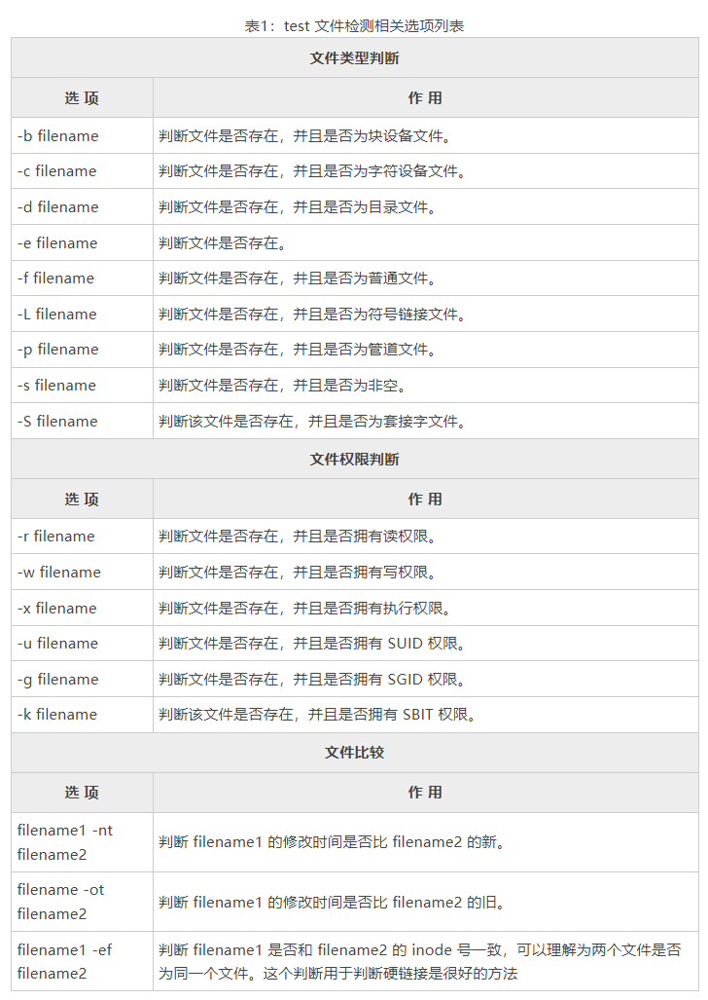
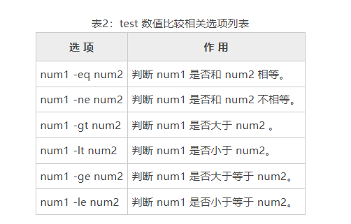
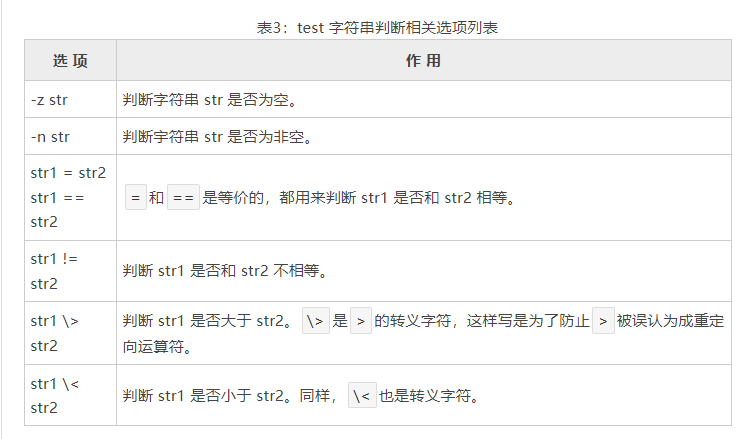
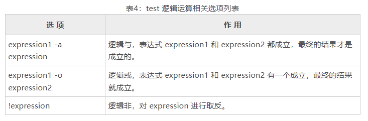

# Shell test命令（Shell [])详解，附带所有选项及说明
test是Shell内置命令，用来检测某个条件是否成立。test通常和if语句一起使用，并且大部分if语句都依赖test。

test 命令有很多选项，可以进行**数值**、**字符串**和**文件**三个方面的检测。

Shell test命令的用法为：
```shell
test expression
```
当test判断expression成立时，退出状态为0，否则为非0值。

test 命令也可以简写为[]，它的用法为：
```shell
[ expression ]
```
注意`[]`和expression之间的**空格**，这两个空格是**必须的**，否则会导致语法错误。[]的写法更加简洁，比 test 使用频率高。

> test 和 [] 是等价的，后续我们会交替使用 test 和 []，以让读者尽快熟悉。

如何使用 test 命令进行数值比较。
```shell
#!/bin/bash

read age

if test $age -le 2; then
  echo "婴儿"
elif [ $age -ge 3 ] && test $age -le 8; then
  echo "幼儿"
elif [ $age -ge 9 ] && [ $age -le 17 ]; then
  echo "少年"
elif [ $age -ge 18 ] && [ $age -le 25 ]; then
      echo "成年"
elif test $age -ge 26 && test $age -le 40; then
    echo "青年"
elif test $age -ge 41 && [ $age -le 60 ]; then
    echo "中年"
else
    echo "老年"
fi
```
其中`-le`表示小于等于，`-ge`表示大于等于，`&&`是逻辑与运算

学习 test 命令，重点是学习它的各种选项，下面我们就逐一讲解。

# 1) 与文件检测相关的 test 选项


Shell test 文件检测举例：
```shell
#!/bin/bash
read filename
read url
if test -w $filename && test -n $url
then
    echo $url > $filename
    echo "写入成功"
else
    echo "写入失败"
fi
```
# 2) 与数值比较相关的 test 选项


注意，test 只能用来比较整数，小数相关的比较还得依赖 bc 命令。

Shell test 数值比较举例：
```shell
#!/bin/bash

read a b
if [ $a -eq $b ]; then
  echo "两个数相等"
else
  echo "两个数不相等"
fi
```
```shell
运行结果1：
10 10
两个数相等

运行结果2：
10 20
两个数不相等
```
# 3) 与字符串判断相关的 test 选项


有C语言、C++、Python、Java 等编程经验的读者请注意，==、>、< 在大部分编程语言中都用来比较数字，而在 Shell 中，它们只能用来比较字符串，不能比较数字，这是非常奇葩的，大家要习惯。

其次，不管是比较数字还是字符串，Shell 都不支持 >= 和 <= 运算符，切记。

Shell test 字符串比较举例：
```shell
#!/bin/bash

read str1
read str2

# 检测字符串是否为空
if [ -z "$str1" ] || [ -z "$str2" ];then
  echo "字符串不能为空"
  exit 0
fi

# 比较字符串
if [ $str1 == $str2 ]; then
    echo "两个字符串相等"
else
    echo "两个字符串不相等"
fi
```
运行结果
```shell
http://c.biancheng.net/
http://c.biancheng.net/shell/
两个字符串不相等
```

细心的读者可能已经注意到，变量 $str1 和 $str2 都被双引号包围起来，这样做是为了防止 $str1 或者 $str2 是空字符串时出现错误，本文的后续部分将为你分析具体原因。

# 4) 与逻辑运算相关的 test 选项


改写上面的代码，使用逻辑运算选项：
```shell
#!/bin/bash
read str1
read str2
#检测字符串是否为空
if [ -z "$str1" -o -z "$str2" ]  #使用 -o 选项取代之前的 ||
then
    echo "字符串不能为空"
    exit 0
fi
#比较字符串
if [ $str1 = $str2 ]
then
    echo "两个字符串相等"
else
    echo "两个字符串不相等"
fi
```
前面的代码我们使用两个[]命令，并使用||运算符将它们连接起来，这里我们改成-o选项，只使用一个[]命令就可以了。

# 在 test 中使用变量建议用双引号包围起来
test和[]都是命令，一个命令本质上对应一个程序或者一个函数。即使是一个程序，它也有入口函数，例如C语言的入口函数就是main，运行C语言程序就是从main()函数开始，
所以也可以将一个程序等效为一个函数，这样我们就不需要区分函数和程序了，直接将一个命令和一个函数对应起来即可、

有了以上的认识，就很容易看透命令的本质了：使用一个命令其实就是调用一个函数，命令后面附带的选项和参数最终都会作为实参传递给函数。

假如test命令对应的函数是func()，使用`test -z $str1`命令的时候，会先将变量$str1替换为字符串：
+ 如果$str1是一个正常的字符串，比如abc123，那么替换后的效果就是`test -z abc123`，调用func()函数的形式就是`func("-z abc123")`。
test 命令后面附带的所有选项和参数会被看成一个整体，并作为实参传递进函数。
+ 如果 $str1 是一个空字符串，那么替换后的效果就是`test -z`，调用 func() 函数的形式就是`func("-z ")`，这就比较奇怪了，
因为-z选项没有和参数成对出现，func() 在分析时就会出错。

如果我们给 $str1 变量加上双引号，当 $str1 是空字符串时，`test -z "$str1"`就会被替换为`test -z ""`，调用 func() 函数的形式就是`func("-z \"\"")`，
很显然，`-z`选项后面跟的是一个空字符串（`\"`表示转义字符），这样 func() 在分析时就不会出错了。

所以，当你在 test 命令中使用变量时，我强烈建议将变量用双引号""包围起来，这样能避免变量为空值时导致的很多奇葩问题。
