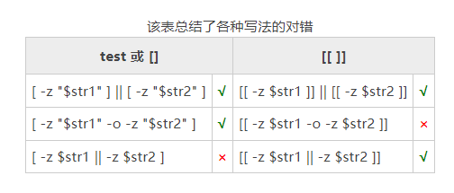

# Shell [[]]详解：检测某个条件是否成立
`[[ ]]`是 Shell 内置关键字，它和 test 命令类似，也用来检测某个条件是否成立。

test 能做到的，[[ ]] 也能做到，而且 [[ ]] 做的更好；test 做不到的，[[ ]] 还能做到。可以认为 [[ ]] 是 test 的升级版，对细节进行了优化，并且扩展了一些功能。

[[ ]] 的用法为：
```shell
[[ expression ]]
```

当 [[ ]] 判断 expression 成立时，退出状态为 0，否则为非 0 值。注意[[ ]]和expression之间的空格，**这两个空格是必须的**，否则会导致语法错误。

# [[ ]] 不需要注意某些细枝末节
[[ ]] 是 Shell 内置关键字，不是命令，在使用时没有给函数传递参数的过程，所以 test 命令的某些注意事项在 [[ ]] 中就不存在了，具体包括：
+ 不需要把变量名用双引号`""`包围起来，即使变量是空值，也不会出错。
+ 不需要、也不能对 >、< 进行转义，转义后会出错。

代码演示
```shell
#!/bin/bash

read str1
read str2

if [[ -z $str1 ]] || [[ -z $str2 ]]; then
  echo "字符串不能为空"
elif [[ $str1 < $str2 ]]; then
  echo "str1 < str2"
else
  echo "str1 >= str2"
fi
```
运行结果：
```shell
[root@zntsa 32.Shell [[]]]# sh code1.sh 
a
a
str1 >= str2
[root@zntsa 32.Shell [[]]]# sh code1.sh 
a
b
str1 < str2
[root@zntsa 32.Shell [[]]]# sh code1.sh 


字符串不能为空
```
# [[ ]] 支持逻辑运算符
对多个表达式进行逻辑运算时，可以使用逻辑运算符将多个 test 命令连接起来，例如：
```shell
[ -z "$str1" ] || [ -z "$str2" ]
```
你也可以借助选项把多个表达式写在一个 test 命令中，例如：
```shell
[ -z "$str1" -o -z "$str2" ]
```
但是，这两种写法都有点“别扭”，完美的写法是在一个命令中使用逻辑运算符将多个表达式连接起来。我们的这个愿望在 [[ ]] 中实现了，[[ ]]  支持 &&、|| 和 ! 三种逻辑运算符。

使用 [[ ]] 对上面的语句进行改进：

```shell
[[ -z $str1 || -z $str2 ]]
```
这种写法就比较简洁漂亮了。

注意，[[ ]] 剔除了 test 命令的`-o`和`-a`选项，你只能使用` || `和` &&`。这意味着，你不能写成下面的形式：
```shell
[[ -z $str1 -o -z $str2 ]]
```
当然，使用逻辑运算符将多个 [[ ]] 连接起来依然是可以的，因为这是 Shell 本身提供的功能，跟 [[ ]] 或者 test 没有关系，如下所示：
```shell
[[ -z $str1 ]] || [[ -z $str2 ]]
```


# [[ ]] 支持正则表达式
在 Shell [[ ]] 中，可以使用`=~`来检测字符串是否符合某个正则表达式，它的用法为：
```shell
[[ str =~ regex ]]
```
str 表示字符串，regex 表示正则表达式。

下面的代码检测一个字符串是否是手机号：
```shell
#!/bin/bash

read tel
if [[ $tel =~ ^1[0-9]{10}$ ]]; then
  echo "你输入的是合法手机号"
else
  echo "你输入的不是合法手机号"
fi
```

对`^1[0-9]{10}$`的说明：
+ `^`匹配字符串的开头（一个位置）；
+ `[0-9]{10}`匹配连续的十个数字；
+ `$`匹配字符串的末尾（一个位置）。

# 总结
有了 [[ ]]，你还有什么理由使用 test 或者 [ ]，[[ ]] 完全可以替代之，而且更加方便，更加强大。

但是 [[ ]] 对数字的比较仍然不友好，所以我建议，以后大家使用 if 判断条件时，用 (()) 来处理整型数字，用 [[ ]] 来处理字符串或者文件。

