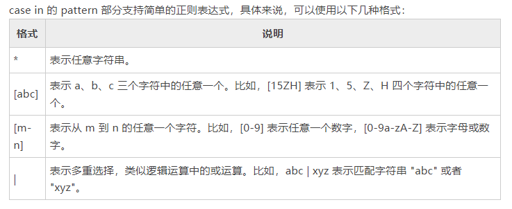

# Shell case in语句详解
当分支较多，并且判断条件比较简单的时候，使用case in语句就比较方便了

我们使用case in语句来重写if else的示例代码，输出整数对应的星期几的英文表示
```shell
#!/bin/bash
printf "Input integer number(1~7):"

read num

case $num in
1)
  echo "Monday"
  ;;
2)
  echo "Tuesday"
  ;;
3)
  echo "Wednesday"
  ;;
4)
  echo "Thursday"
  ;;
5)
  echo "Friday"
  ;;
6)
  echo "Saturday"
  ;;
7)
  echo "Sunday"
  ;;
*)
  echo "error"
esac
```
运行结果：
```shell
运行结果：
Input integer number:3↙
Wednesday
```
case in的语法如下：
```shell
case expression in
  pattern1)
    statement1
    ;;
  pattern2)
    statement2
    ;;
  pattern3)
    statement3
    ;;
  ......
  *)
    statementn
esac
```
case、in 和 esac 都是 Shell 关键字，expression 表示表达式，pattern 表示匹配模式。
+ expression既可以是一个变量、一个数字、一个字符串，还可以是一个数学计算表达式，或者是命令的执行结果，只要能够得到expression的值就可以
+ pattern可以是一个数字、一个字符串，甚至是一个简单的正则表达式

case 会将 expression  的值与 pattern1、pattern2、pattern3 逐个进行匹配：
+ 如果 expression 和某个模式（比如 pattern2）匹配成功，就会执行这模式（比如 pattern2）后面对应的所有语句（该语句可以有一条，也可以有多条），直到遇见双分号`;;`才停止；然后整个 case 语句就执行完了，程序会跳出整个 case 语句，执行 esac 后面的其它语句。
+ 如果 expression 没有匹配到任何一个模式，那么就执行`*)`后面的语句（*表示其它所有值），直到遇见双分号`;;`或者`esac`才结束。`*)`相当于多个 if 分支语句中最后的 else 部分。

> 如果你有C语言、C++、Java 等编程经验，这里的;;和*)就相当于其它编程语言中的 break 和 default。

对`*)`的几点说明：
+ Shell case in语句中的`*)`用来兜底，万一expression没有匹配到任何一个模式，`*)`部分可以执行一些善后工作，或者给用户一些提示
+ 也可以没有`*)`这部分，那么当expression没有匹配到任何模式的时候，就不执行任何的操作。

除了最后一个分支以外（这个分支可以是普通分支，也可以是`*)`分支），其他的每个分支都必须以`;;`结尾，`;;`代表了一个分支的结束，不写的话会有语法错误。
最后一个分支可以写`;;`也可以不写，因为无论如何，执行到esac都会结束整个case in语句。

上面的代码是 case in 最常见的用法，即 expression 部分是一个变量，pattern 部分是一个数字或者表达式。

# case in 和正则表达式


如果不加以说明，Shell 的值都是字符串，expression 和 pattern 也是按照字符串的方式来匹配的；本节第一段代码看起来是判断数字是否相等，其实是判断字符串是否相等。

最后一个分支`*)`并不是什么语法规定，它只是一个正则表达式，`*`表示任意字符串，所以不管 expression 的值是什么，`*)`总能匹配成功。

下面的例子演示了如何在 case in 中使用正则表达式：
```shell
#!/bin/bash

printf "Input a character："
read -n 1 char

case $char in
  [a-zA-Z])
    printf "\nletter\n"
    ;;
  [0-9])
    printf "\nDigit\n"
    ;;
  [,.?!])
    printf "\nPunctuation\n"
    ;;
  *)
    printf "\nerror\n"
esac
```
```shell
运行结果1：
Input integer number: S
letter

运行结果2：
Input integer number: ,
Punctuation
```