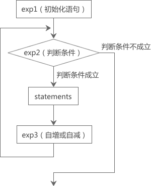

# Shell for循环和for int循环详解
除了while循环和until循环，Shell脚本还提供了for循环，它更加灵活易用，更加简洁明了。Shell中的for循环有两种使用形式
# C语言风格的for循环
C语言风格的for循环的用法如下：
```shell
for ((exp1;exp2;exp3))
do
  statements    
done
```
几点说明：
+ exp1、exp2、exp3是三个表达式，其中exp2是判断条件，for循环根据exp2的结果来决定是否继续下一次循环
+ statements是循环体语句，可以有一条或多条
+ do和done是Shell中的关键字

它的运行过程为：
1. 首先执行exp1
2. 再执行exp2，如果它的判断是成立的，则执行循环体中的语句，否则就结束整个for循环
3. 执行循环体后再执行exp3
4. 重复执行步骤2和3，直到exp2的判断结果不成立，就结束循环。

上面的步骤中，2和3合并在一起算作一次循环，会重复执行，for语句的主要作用就是不断执行步骤2和3

exp1仅仅在第一次循环时运行，以后都不会再执行，可以认为它是一个初始化语句。exp2一般是一个关系表达式，决定了是否还要继续进行下一次循环，称为“循环条件”。
exp3很多情况下是一个带有自增或自减运算的表达式，以便是循环条件逐渐变得“不成立”

for 循环的执行过程可用下图表示：


下面我们给出一个实际的例子，计算从 1 加到 100 的和。
```shell
#!/bin/bash

sum=0
for (( i = 1; i <= 100; i++ )); do
    ((sum+=i))
done
echo "the sum is $sum"
```
运行结果：
```shell
$ sh code1.sh
the sum is 5050
```
代码分析：
1. 执行到 for 语句时，先给变量 i 赋值为 1，然后判断 i<=100 是否成立；因为此时 i=1，所以 i<=100 成立。接下来会执行循环体中的语句，等循环体执行结束后（sum 的值为1），再计算 i++。
2. 第二次循环时，i 的值为2，i<=100 成立，继续执行循环体。循环体执行结束后（sum的值为3），再计算 i++。
3. 重复执行步骤 2)，直到第 101 次循环，此时 i 的值为 101，i<=100 不再成立，所以结束循环。

由此我们可以总结出 for 循环的一般形式为：
```shell
for(( 初始化语句; 判断条件; 自增或自减 ))
do
    statements
done
```
### for循环中的三个表达式
for循环中，exp1（初始化语句）、exp2（判断条件）、exp3（自增或自减）都是可选项，都可以省略，但是分号`;`必须保留

1) 修改“从 1 加到 100 的和”的代码，省略 exp1：
```shell
#!/bin/bash

sum=0
i=1
for ((; i <= 100; i++ )); do
    ((sum+=i))
done
echo "the sum is $sum"
```
可以看到，将`i=1`移到了 for 循环的外面。

2) 省略 exp2，就没有了判断条件，如果不作其他处理就会成为死循环，我们可以在循环体内部使用 break 关键字强制结束循环：
```shell
#!/bin/bash

sum=0
for (( i=1;; i++ )); do
    if ((i>100)); then
        break
    fi
    ((sum+=i))
done
echo "the sum is $sum"
```
break 是 Shell 中的关键字，专门用来结束循环，后续章节还会深入讲解。

3) 省略了 exp3，就不会修改 exp2 中的变量，这时可在循环体中加入修改变量的语句。例如：
```shell
#!/bin/bash

sum=0
for (( i = 1; i <= 100;)); do
    ((sum+=i))
    ((i++))
done
echo "the sum is $sum"
```
4) 最后给大家看一个更加极端的例子，同时省略三个表达式：
```shell
#!/bin/bash

sum=0
i=1
for ((;;)); do
  if ((i>100)); then
      break
  fi
    ((sum+=i))
    ((i++))
done
echo "the sum is $sum"
```
这种写法并没有什么实际意义，仅仅是为了给大家做演示。

# Python风格的for in循环
Python 风格的 for in 循环的用法如下：
```shell
for variable in value_list
do
    statements
done
```
variable表示变量，value_list表示取值列表，in是Shell中的关键字
> in value_list部分可以省略，省略后的效果相当于in $@「value_list 使用特殊变量」将会详细讲解。

每次循环都会从value_list中取出一个值赋给变量variable，然后进入循环体（do和done之间的部分），执行循环体中的statements，直到取完value_list中的所有值，
循环结束。
Shell for in循环举例：
```shell
#!/bin/bash

sum=0
for n in 1 2 3 4 5 6
do
  echo $n
  ((sum+=n))
done
echo "The sum is $sum"
```
运行结果
```shell
$ sh code6.sh
1
2
3
4
5
6
The sum is 21
```
## 对value_list的说明
取值列表value_list的形式有很多种，可以直接给出具体的值，也可以给出一个范围，还可以使用命令产生的结果，甚至使用通配符，下面是一些例子

1)直接给出具体的值

可以在 in 关键字后面直接给出具体的值，多个值之间以空格分隔，比如1 2 3 4 5、"abc" "390" "tom"等。

上面的代码中用一组数字作为取值列表，下面我们再演示一下用一组字符串作为取值列表：
```shell
#!/bin/bash
for str in "C语言中文网" "http://c.biancheng.net/" "成立7年了" "日IP数万"
do
    echo $str
done
```
运行结果：
```shell
$ sh code7.sh
C语言中文网
http://c.biancheng.net/
成立7年了
日IP数万
```

2)给出一个范围

给出一个取值范围的具体格式为：
```shell
{start..end}
```
start 表示起始值，end 表示终止值；注意中间用两个点号相连，而不是三个点号。根据笔者的实测，这种形式只支持数字和字母。

例如，计算1加到100的和
```shell
#!/bin/bash

sum=0
for i in {1..100}
do
  ((sum+=i))
done
echo "The sum is $sum"
```
运行结果：
```
5050
```
再如，输出从 A 到 z 之间的所有字符：
```shell
#!/bin/bash

for char in {A..z}; do
  printf "%c" $char
done
```
输出结果：
```shell
ABCDEFGHIJKLMNOPQRSTUVWXYZ[]^_`abcdefghijklmnopqrstuvwxyz
```
可以发现，Shell 是根据 ASCII 码表来输出的。


