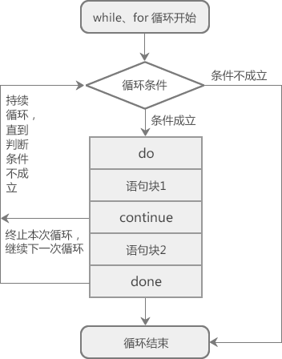

# Shell break和continue跳出循环详解
使用while、until、for、select循环时，如果想提前结束循环（在不满足结束条件的情况下结束循环），可以使用break或者continue关键字

在C语言、C++、C#、Python、Java等大部分编程语言中，break和continue都只能跳出当前层次的循环，内层循环中的break和continue对外层循环不起作用；
但是Shell中的break和continue却可以跳出多层循环，也就是说，内层循环中的break和continue能够跳出外层循环

在实际开发过程中，break和continue一般只用来跳出当前层次的循环，很少有需要跳出多层循环的情况。

# break关键字
Shell break关键字的用法为：
```shell
break n
```
n表示跳出循环的层数，如果省略n，则表示跳出当前的整个循环。break语句通常和if语句一起使用，即满足条件就跳出循环


【实例1】不断从终端读取用户输入的正数，求它们相加的和：
```shell
#!/bin/bash

sum=0
while read n; do
  if ((n>0)); then
    ((sum+=n))
  else
    break
  fi
done

echo "sum=$sum"
```
运行结果：
```shell
$ sh code1.sh
1
2
3
-1
sum=6
```

while 循环通过 read 命令的退出状态来判断循环条件是否成立，只有当按下 Ctrl+D 组合键（表示输入结束）时，`read n`才会判断失败，此时 while 循环终止。

除了按下 Ctrl+D 组合键，你还可以输入一个小于等于零的整数，这样会执行 break 语句来终止循环（跳出循环）。

【实例2】使用break跳出双层循环

如果break后面不跟数字的话，表示跳出当前循环，对于有两层嵌套的循环，就得使用两个break关键字。例如，输出一个4*4的矩阵
```shell
#!/bin/bash

i=0
while ((++i)); do #外层循环
  if ((i>4)); then
    break #跳出外层循环
  fi
  j=0
  while ((++j)); do #内层循环
    if ((j>4)); then
      break #跳出内层循环
    fi
    printf "%-4d" $((i*j))

  done
  printf "\n"
done
```
运行结果：
```shell
$ sh code2.sh
1   2   3   4
2   4   6   8
3   6   9   12
4   8   12  16
```
当 j>4 成立时，执行第二个 break，跳出内层循环；外层循环依然执行，直到 i>4 成立，跳出外层循环。内层循环共执行了 4 次，外层循环共执行了 1 次。

我们也可以在 break 后面跟一个数字，让它一次性地跳出两层循环，请看下面的代码：
```shell
#!/bin/bash

i=0
while ((++i)); do  #外层循环
    j=0;
    while ((++j)); do  #内层循环
        if((i>4)); then
            break 2  #跳出内外两层循环
        fi
        if((j>4)); then
            break  #跳出内层循环
        fi
        printf "%-4d" $((i*j))
    done

    printf "\n"
done
```
修改后的代码将所有 break 都移到了内层循环里面。读者需要重点关注`break 2`这条语句，它使得程序可以一次性跳出两层循环，也就是先跳出内层循环，再跳出外层循环。

# continue关键字
Shell continue关键字的用法为：
```shell
continue n
```
n表示循环的层数：
+ 如果省略 n，则表示 continue 只对当前层次的循环语句有效，遇到 continue 会跳过本次循环，忽略本次循环的剩余代码，直接进入下一次循环。
+ 如果带上 n，比如 n 的值为 2，那么 continue 对内层和外层循环语句都有效，不但内层会跳过本次循环，外层也会跳过本次循环，其效果相当于内层循环和外层循环同时执行了不带 n 的 continue。这么说可能有点难以理解，稍后我们通过代码来演示。

continue 关键字也通常和 if 语句一起使用，即满足条件时便跳出循环。 



【实例1】不断从终端读取用户输入的 100 以内的正数，求它们的和：
```shell
#!/bin/bash

sum=0
while read n; do
  if ((n<1 || n>100)); then
    continue
  fi
  ((sum+=n))
done

echo "sum=$sum"
```
运行结果：
```shell
$ sh code4.sh
1
2
3
999
sum=6
```
sum的值为6，可见999并没有计算在内，因为其不在1~100之间，if判断条件成立，执行continue，也就跳过了`((sum+=n))`这条语句

注意，只有按下 Ctrl+D 组合键输入才会结束，`read n`才会判断失败，while 循环才会终止。

【实例2】使用 continue 跳出多层循环，请看下面的代码：
```shell
#!/bin/bash

for (( i = 1; i <= 5; i++ )); do
    for (( j = 1; j <= 5; j++ )); do
        if ((i*j==12)); then
          continue 2
        fi
        printf "%d*%d=%-4d" $i $j $((i*j))
    done
    printf "\n"
done
```
运行结果：
```shell
1*1=1   1*2=2   1*3=3   1*4=4   1*5=5
2*1=2   2*2=4   2*3=6   2*4=8   2*5=10
3*1=3   3*2=6   3*3=9   4*1=4   4*2=8   5*1=5   5*2=10  5*3=15  5*4=20  5*5=25
```
从运行结果可以看出，遇到`continue 2`时，不但跳过了内层 for 循环，也跳过了外层 for 循环。

# break和continue的区别
break用来结束所有循环，循环语句不再有执行的机会；continue用来结束本次循环，直接跳到下一次循环，如果循环条件成立，还会继续循环。

