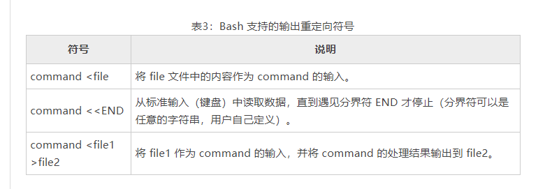

# Linux Shell重定向（输入输出重定向）精讲

Linux Shell重定向分为两种，一种是输入重定向，一种是输出重定向，从字面上理解，输入输出重定向就是【改变输入与输出的方向】的意思

那么，什么是输出输出方向呢？标准的输出和输出的方向又是什么呢

一般情况下，我们都是从键盘读取用户输入的数据，然后再把数据拿到程序（C语言程序、Shell脚本程序等）中使用；这就是标准的输入方向，也就是从键盘到程序。

反过来说，程序也会产生数据，这些数据一般都是直接显示在显示器上，这就是标准输出的方向。也就是从程序到显示器。

我们可以把观点提炼一下，其实输入输出方向就是数据的流动方向：
+ 输入方向就是数据从哪里流向程序。数据默认从键盘流向程序，如果改变了它的方向，数据就从其他地方流入，这就是输入重定向
+ 输出方向就是数据从程序流向哪里。数据默认流向显示器，如果改变了它的方向，数据就会流向其他地方，这就是输出重定向。

# 硬件设备和文件描述符
计算机的硬件设备有很多，常见的输入设备有键盘、鼠标、麦克风、手写板等，输出设备有显示器、投影仪、打印机等。不过，在 Linux 中，
标准输入设备指的是**键盘**，标准输出设备指的是**显示器**。

**Linux 中一切皆文件**，包括标准输入设备（键盘）和标准输出设备（显示器）在内的所有计算机硬件都是文件。

为了表示和区分已经打开的文件，Linux 会给每个文件分配一个 ID，这个 ID 就是一个整数，被称为文件描述符（File Descriptor）。

表1：与输入输出有关的文件描述符

| 文件描述符 | 文件名 | 类型     | 硬件  |
|---|---|--------|-----|                                      
| 0 | stdin | 标准输入文件 | 键盘  |
| 1 | stdout | 标准输出文件 | 显示器 |
| 2 | stderr | 标准错误输出 | 显示器 |

Linux程序在执行任何形式的I/O操作时，都是在读取或写入一个文件描述符。一个文件描述符只是一个和打开的文件相关联的整数，
它的背后可能是硬盘上的普通文件、FIFO、管道、终端、键盘、显示器，甚至是一个网络连接。

stdin、stdout、stderr 默认都是打开的，在重定向的过程中，0、1、2 这三个文件描述符可以直接使用。

# Linux Shell 输出重定向
输出重定向是指命令的结果不再输出到显示器上，而是输出到其他的地方，一般是文件中。这样做的最大好处就是把命令的结果保存起来，
当我们需要的时候可以随时查询。Bash支持的输出重定向符号如下表所示。


在重定向输出中`>`表示覆盖，`>>`表示追加

**注意**

输出重定向的完整写法其实是`fd>file`或者`fd>>file`，其中 `fd` 表示文件描述符，如果不写，默认为 `1`，也就是标准输出文件。

当文件描述符为 `1` 时，**一般都省略不写**，如上表所示；当然，如果你愿意，也可以将`command >file`写作`command 1>file`，但这样做是多此一举。

**当文件描述符为大于 1 的值时，比如 2，就必须写上。**

需要重点说明的是，`fd`和`>`之间**不能有空格**，否则 Shell 会解析失败；`>`和`file`之间的空格可有可无。为了保持一致，我习惯在>两边都不加空格。

下面的语句是一个反面教材：
```shell
echo "c.biancheng.net" 1 >log.txt
```
注意`1`和`>`之间的空格。echo 命令的输出结果是`c.biancheng.net`，我们的初衷是将输出结果重定向到 log.txt，但是当你打开 log.txt 文件后，发现文件的内容为`c.biancheng.net 1`，这就是多余的空格导致的解析错误。也就是说，Shell 将该条语句理解成了下面的形式：
```shell
echo "c.biancheng.net" 1 1>log.txt
```
在解释领一下命令：
```shell
nohup tcpreplay -i enp5s0 -K -M 10 udp-64.pcap > /dev/null 2>&1  &
```
+ 其中，`/dev/null`是一个特殊的文件,写入到它的内容都会被丢弃。
+ 第一个重定向符号使用的是单个的`>`，表示覆盖写入，其实在这里用`>>`追加写入也行，但是没什么意义，反正之前的都丢弃了，还追加个啥劲呢。
+ `2>&1`表示把标准错误输出（2）重定向到标准输出（1）
+ 重定向数据流时， & 意味着后面是文件描述符，而不是文件名。 所以在`2>&1`中的`1`之前要加上`&`

**输出重定向举例**
【实例1】将echo命令的输出结果以追加的方式写入到demo.txt文件中
```shell
#!/bin/bash

for str in "C语言中文网" "http://c.biancheng.net/" "成立7年了" "日IP数万"
do
  echo $str >> demo.txt
done
```
运行上面的脚本，使用`cat demo.txt`命令查看文件内容，显示如下：
```shell
C语言中文网
http://c.biancheng.net/
成立7年了
日IP数万
```

【实例2】将`ls -l`命令的输出结果重定向到文件中
```shell
[root@zntsa 1.Shell重定向]# ls -l   #先预览一下输出结果
total 16
-rw-r--r-- 1 root root  131 Apr 14 09:22 code1.sh
-rw-r--r-- 1 root root    0 Apr 14  2023 code2.sh
-rw-r--r-- 1 root root   67 Apr 14 09:21 demo.txt
-rw-r--r-- 1 root root 5202 Apr 14  2023 note.md
[root@zntsa 1.Shell重定向]# ls -l > demo.txt  #重定向
[root@zntsa 1.Shell重定向]# cat demo.txt   # 查看文件内容
total 12
-rw-r--r-- 1 root root  131 Apr 14 09:22 code1.sh
-rw-r--r-- 1 root root    0 Apr 14  2023 code2.sh
-rw-r--r-- 1 root root    0 Apr 14 09:24 demo.txt
-rw-r--r-- 1 root root 5202 Apr 14  2023 note.md

```
**错误输出重定向举例**
命令正确执行是没有错误信息的，我们需要可以让明框执行出错，如下所示：
```shell
[root@zntsa ~]# ls java # 先预览一下出错信息
ls: cannot access java: No such file or directory
[root@zntsa ~]# ls java 2>err.log #错误输出重定向
[root@zntsa ~]# cat err.log # 查看文件
ls: cannot access java: No such file or directory
```

**正确输出和错误信息同时保存**

【实例1】把正确结果和错误信息都保存到一个文件中，例如：
```shell
[root@zntsa ~]# ls java
ls: cannot access java: No such file or directory
[root@zntsa ~]# ls java 2>err.log
[root@zntsa ~]# cat err.log 
ls: cannot access java: No such file or directory
[root@zntsa ~]# ls -l > out.log 2>&1
[root@zntsa ~]# ls java >> out.log 2>&1
[root@zntsa ~]# cat out.log 
total 31390824
-rw-r--r--   1 root    root         516904 Aug 12  2022 0.pcap
-rw-r--r--   1 tcpdump tcpdump    19541131 Dec  3  2021 1203.pcap
-rw-r--r--   1 tcpdump tcpdump        1050 Jul 16  2022 1.pcap
ls: cannot access java: No such file or directory
```
out.log 的最后一行是错误信息，其它行都是正确的输出结果。

【实例2】上面的实例将正确结果和错误信息都写入同一个文件中，这样会导致视觉上的混乱，不利于以后的检索，所以我建议把正确结果和错误信息分开保存到不同的文件中，也即写成下面的形式：
```shell
ls -l >>out.log 2>>err.log
```
这样一来，正确的输出结果会写入到 out.log，而错误的信息则会写入到 err.log。

**/dev/null 文件**
如果你既不想把命令的输出结果保存到文件，也不想把命令的输出结果显示到屏幕上，干扰命令的执行，那么可以把命令的所有结果重定向到 /dev/null 文件中。如下所示：
```shell
ls -l &>/dev/null
```
大家可以把 /dev/null 当成 Linux 系统的垃圾箱，任何放入垃圾箱的数据都会被丢弃，不能恢复。

# Linux Shell 输入重定向
输入重定向就是改变输入的方向，不再使用键盘作为命令输入的来源，而是使用文件作为命令的输入。



和输出重定向类似，输入重定向的完整写法是`fd<file`，其中fd表示文件描述符，如果不写，默认为0也就是标准输入文件

**输入重定向举例**

【示例1】统计文档中有多少行文字。

Linux wc命令可以用来对文本进行统计，包括单词个数、行数、字节数，用法如下
```shell
wc  [选项]  [文件名]
```
其中，`-c`选项统计字节数，`-w`选项统计单词数，`-l`选项统计行数。

统计 readme.txt 文件中有多少行文本：
```shell
[root@zntsa 1.Shell重定向]# cat readme.txt 
asdf
sdfsadf
asdfasdf
sdafaf
sadfasd
sdfsa
qwweq
[root@zntsa 1.Shell重定向]# wc -l <readme.txt 
7
```
【实例2】逐行读取文件内容。
```shell
#!/bin/bash

while read str; do
    echo $str
done <readme.txt
```
运行结果：
```shell
C语言中文网
http://c.biancheng.net/
成立7年了
日IP数万
```
这种写法叫做代码块重定向，也就是把一组命令同时重定向到一个文件，我们将在《Shell代码块重定向》一节中详细讲解。

【实例3】统计用户在终端输入的文本的行数。

此处我们使用输入重定向符号`<<`，这个符号的作用是使用特定的分界符作为命令输入的结束标志，而不使用 Ctrl+D 键。
```shell
[c.biancheng.net]$ wc -l <<END
> 123
> 789
> abc
> xyz
> END
4
```
wc 命令会一直等待用输入，直到遇见分界符 END 才结束读取。

`<<`之后的分界符可以自由定义，只要再碰到相同的分界符，两个分界符之间的内容将作为命令的输入（不包括分界符本身）。
