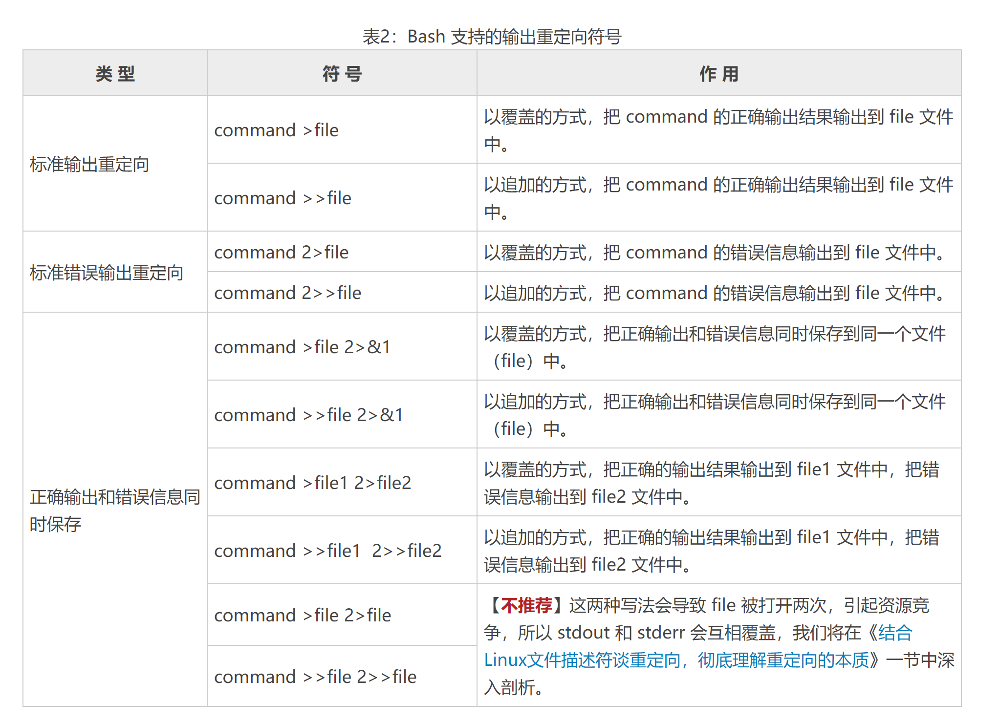

# Linux Shell重定向（输入输出重定向）精讲

Linux Shell重定向分为两种，一种是输入重定向，一种是输出重定向，从字面上理解，输入输出重定向就是【改变输入与输出的方向】的意思

那么，什么是输出输出方向呢？标准的输出和输出的方向又是什么呢

一般情况下，我们都是从键盘读取用户输入的数据，然后再把数据拿到程序（C语言程序、Shell脚本程序等）中使用；这就是标准的输入方向，也就是从键盘到程序。

反过来说，程序也会产生数据，这些数据一般都是直接显示在显示器上，这就是标准输出的方向。也就是从程序到显示器。

我们可以把观点提炼一下，其实输入输出方向就是数据的流动方向：
+ 输入方向就是数据从哪里流向程序。数据默认从键盘流向程序，如果改变了它的方向，数据就从其他地方流入，这就是输入重定向
+ 输出方向就是数据从程序流向哪里。数据默认流向显示器，如果改变了它的方向，数据就会流向其他地方，这就是输出重定向。

# 硬件设备和文件描述符
计算机的硬件设备有很多，常见的输入设备有键盘、鼠标、麦克风、手写板等，输出设备有显示器、投影仪、打印机等。不过，在 Linux 中，
标准输入设备指的是**键盘**，标准输出设备指的是**显示器**。

**Linux 中一切皆文件**，包括标准输入设备（键盘）和标准输出设备（显示器）在内的所有计算机硬件都是文件。

为了表示和区分已经打开的文件，Linux 会给每个文件分配一个 ID，这个 ID 就是一个整数，被称为文件描述符（File Descriptor）。

表1：与输入输出有关的文件描述符

| 文件描述符 | 文件名 | 类型     | 硬件  |
|---|---|--------|-----|                                      
| 0 | stdin | 标准输入文件 | 键盘  |
| 1 | stdout | 标准输出文件 | 显示器 |
| 2 | stderr | 标准错误输出 | 显示器 |

Linux程序在执行任何形式的I/O操作时，都是在读取或写入一个文件描述符。一个文件描述符只是一个和打开的文件相关联的整数，
它的背后可能是硬盘上的普通文件、FIFO、管道、终端、键盘、显示器，甚至是一个网络连接。

stdin、stdout、stderr 默认都是打开的，在重定向的过程中，0、1、2 这三个文件描述符可以直接使用。

# Linux Shell 输出重定向
输出重定向是指命令的结果不再输出到显示器上，而是输出到其他的地方，一般是文件中。这样做的最大好处就是把命令的结果保存起来，
当我们需要的时候可以随时查询。Bash支持的输出重定向符号如下表所示。



在重定向输出中`>`表示覆盖，`>>`表示追加

**注意**

输出重定向的完整写法其实是`fd>file`或者`fd>>file`，其中 `fd` 表示文件描述符，如果不写，默认为 `1`，也就是标准输出文件。

当文件描述符为 `1` 时，**一般都省略不写**，如上表所示；当然，如果你愿意，也可以将`command >file`写作`command 1>file`，但这样做是多此一举。

**当文件描述符为大于 1 的值时，比如 2，就必须写上。**

需要重点说明的是，`fd`和`>`之间**不能有空格**，否则 Shell 会解析失败；`>`和`file`之间的空格可有可无。为了保持一致，我习惯在>两边都不加空格。

下面的语句是一个反面教材：
```shell
echo "c.biancheng.net" 1 >log.txt
```
注意`1`和`>`之间的空格。echo 命令的输出结果是`c.biancheng.net`，我们的初衷是将输出结果重定向到 log.txt，但是当你打开 log.txt 文件后，发现文件的内容为`c.biancheng.net 1`，这就是多余的空格导致的解析错误。也就是说，Shell 将该条语句理解成了下面的形式：
```shell
echo "c.biancheng.net" 1 1>log.txt
```
在解释领一下命令：
```shell
nohup tcpreplay -i enp5s0 -K -M 10 udp-64.pcap > /dev/null 2>&1  &
```
+ 其中，`/dev/null`是一个特殊的文件,写入到它的内容都会被丢弃。
+ 第一个重定向符号使用的是单个的`>`，表示覆盖写入，其实在这里用`>>`追加写入也行，但是没什么意义，反正之前的都丢弃了，还追加个啥劲呢。
+ `2>&1`表示把标准错误输出（2）重定向到标准输出（1）
+ 重定向数据流时， & 意味着后面是文件描述符，而不是文件名。 所以在`2>&1`中的`1`之前要加上`&`