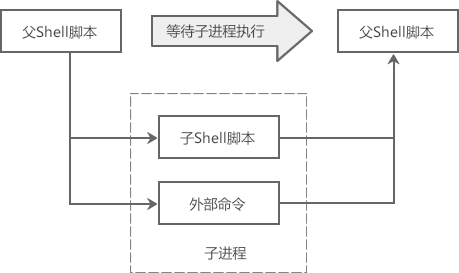

# 子Shell和子进程到底有什么区别？
Shell 中有很多方法产生子进程，比如以新进程的方式运行 Shell 脚本，使用组命令、管道、命令替换等，但是这些子进程是有区别的。

子进程的概念是由父进程的概念引申而来的。在 Linux 系统中，系统运行的应用程序几乎都是从 init（pid为 1 的进程）进程派生而来的，
所有这些应用程序都可以视为 init 进程的子进程，而 init 则为它们的父进程。

使用`pstree -p`命令就可以看到 init 及系统中其他进程的进程树信息（包括 pid）：
```shell
[root@zntsa ~]# pstree -p
systemd(1)─┬─abrt-watch-log(775)
           ├─abrtd(772)
           ├─agetty(1506)
           ├─atd(795)
           ├─crond(794)
           ├─cupsd(1435)
           ├─dbus-daemon(756)
           ├─gpio(1445)
           ├─gssproxy(782)─┬─{gssproxy}(787)
           │               ├─{gssproxy}(788)
           │               ├─{gssproxy}(789)
           │               ├─{gssproxy}(790)
           │               └─{gssproxy}(791)
           ├─irqbalance(769)
           ├─lsmd(766)
           ├─lvmetad(563)
           ├─mysqld_safe(1469)───mysqld(1860)─┬─{mysqld}(1894)
           │                                  ├─{mysqld}(1895)
           │                                  ├─{mysqld}(1896)
           │                                  ├─{mysqld}(1897)
```
本教程基于 CentOS 7 编写，CentOS 7 为了提高启动速度使用 systemd 替代了 init。CentOS 7 之前的版本依然使用 init。

Shell脚本是从上至下，从左至右依次执行的，即执行完一个命令后再执行下一个。如果在 Shell 脚本中遇到子脚本（即脚本嵌套，但是必须以新进程的方式运行）或者外部命令，
就会向系统内核申请创建一个新的进程，以便在该进程中执行子脚本或者外部命令，这个新的进程就是子进程。子进程执行完毕后才能回到父进程，
才能继续执行父脚本中后续的命令及语句。



# 子进程的创建
了解 Linux 编程的读者应该知道，使用 fork() 函数可以创建一个子进程；除了 PID（进程ID）等极少的参数不同外，子进程的一切都来自父进程，
包括代码、数据、堆栈、打开的文件等，就连代码的执行位置（状态）都是一样的。

也就是说，fork() 克隆了一个一模一样的自己，身高、体重、颜值、嗓音、年龄等各种属性都相同。当然，后期随着各自的发展轨迹不同，两者会变得不一样，
比如 A 好吃懒做越来越肥，B 经常健身成了一个肌肉男；但是在 fork() 出来的那一刻，两者都是一样的。

Linux 还有一种创建子进程的方式，就是子进程被 fork() 出来以后立即调用 exec() 函数加载新的可执行文件，而不使用从父进程继承来的一切。什么意思呢？

比如在 ~/bin 目录下有两个可执行文件分别叫 a.out 和 b.out。现在我运行 a.out，就会产生一个进程，比如叫做 A。在进程 A 中我又调用 fork() 函数创建了一个进程 B，
那么 B 就是 A 的子进程，此时它们是一模一样的。但是，我调用 fork() 后立即又调用 exec() 去加载 b.out，这可就坏事了，
B 进程中的一切（包括代码、数据、堆栈等）都会被销毁，然后再根据 b.out 重建建立一切。这样一折腾，B 进程除了 ID 没有变，其它的都变了，
再也没有属于 A 的东西了。

你看，同样是创建子进程，但是结果却大相径庭：
+ 第一种只使用 fork() 函数，子进程和父进程几乎是一模一样的，父进程中的函数、变量、别名等在子进程中仍然有效。
+ 第二种使用 fork() 和 exec() 函数，子进程和父进程之间除了硬生生地维持一种“父子关系”外，再也没有任何联系了，它们就是两个完全不同的程序。

对于 Shell 来说，以新进程的方式运行脚本文件，比如`bash ./test.sh`、`chmod +x ./test.sh; ./test.sh`，或者在当前 Shell 中使用 bash 命令启动新的 Shell，
它们都属于**第二种创建子进程的方式**，所以子进程除了能继承父进程的环境变量外，基本上也不能使用父进程的什么东西了，比如，父进程的全局变量、局部变量、文件描述符、别名等在子进程中都无效。

但是，**组命令、命令替换、管道**这几种语法都使用第一种方式创建进程，所以子进程可以使用父进程的一切，包括全局变量、局部变量、别名等。
我们将这种子进程称为**子 Shell（sub shell）**。

子 Shell 虽然能使用父 Shell 的的一切，但是如果子 Shell 对数据做了修改，比如修改了全局变量，那么这种修改只能停留在子 Shell，无法传递给父 Shell。不管是子进程还是子 Shell，都是“传子不传父”。

# 总结
子 Shell 才是真正继承了父进程的一切，这才像“一个模子刻出来的”；普通子进程和父进程是完全不同的两个程序，只是维持着父子关系而已。
