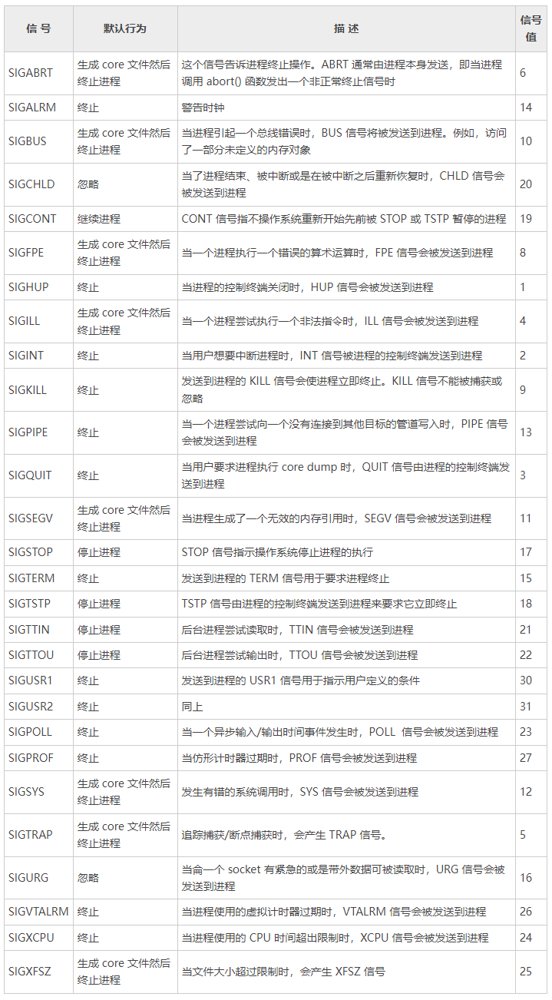

# Linux中的信号是什么
在 Linux 中，理解信号的概念是非常重要的。这是因为，信号被用于通过 Linux 命令行所做的一些常见活动中。
例如，每当你按 Ctrl+C 组合键来从命令行终结一个命令的执行，你就使用了信号。每当你使用如下命令来结束一个进程时，你就使用了信号：
```shell
kill -9 PID
```
所以，至少知道信号的基本原理是非常有用的。

# Linux中的信号
在 Linux 系统（以及其他类 Unix 操作系统）中，信号被用于进程间的通信。信号是一个发送到某个进程或同一进程中的特定线程的异步通知，
用于通知发生的一个事件。从 1970 年贝尔实验室的 Unix 面世便有了信号的概念，而现在它已经被定义在了 POSIX 标准中。

对于在 Linux 环境进行编程的用户或系统管理员来说，较好地理解信号的概念和机制是很重要的，在某些情况下可以帮助我们更高效地编写程序。对于一个程序来说，
如果每条指令都运行正常的话，它会连续地执行。但如果在程序执行时，出现了一个错误或任何异常，内核就可以使用信号来通知相应的进程。

信号同样被用于通信、同步进程和简化进程间通信，在 Linux 中，信号在处理异常和中断方面，扮演了极其重要的角色。
信号巳经在没有任何较大修改的情况下被使用了将近 30 年。

当一个事件发生时，会产生一个信号，然后内核会将事件传递到接收的进程。有时，进程可以发送一个信号到其他进程。除了进程到进程的信号外，还有很多种情况，
内核会产生一个信号，比如文件大小达到限额、一个 I/O 设备就绪或用户发送了一个类似于 Ctrl+C 或 Ctrl+Z 的终端中断等。

运行在用户模式下的进程会接收信号。如果接收的进程正运行在内核模式，那么信号的执行只有在该进程返回到用户模式时才会开始。

发送到非运行进程的信号一定是由内核保存，直到进程重新执行为止。休眠的进程可以是可中断的，也可以是不可中断的。如果一个在可中断休眠状态的进程
（例如，等待终端输入的进程）收到了一个信号，那么内核会唤醒这个进程来处理信号。如果一个在不可中断休眠状态的进程收到了一个信号，那么内核会拖延此信号，
直到该事件完成为止。

当进程收到一个信号时，可能会发生以下 3 种情况：
+ 进程可能会忽略此信号。有些信号不能被忽略，而有些没有默认行为的信号，默认会被忽略。
+ 进程可能会捕获此信号，并执行一个被称为信号处理器的特殊函数。
+ 进程可能会执行信号的默认行为。例如，信号 15(SIGTERM) 的默认行为是结束进程。

当一个进程执行信号处理时，如果还有其他信号到达，那么新的信号会被阻断直到处理器返冋为止。

# 信号的名称和值
每个信号都有以`SIG`开头的名称，并定义为唯一的正整数。在Shell命令行提示符下，输入`kill -l`命令，将显示所有信号的信号值和相应的信号名，类似如下所示：
```shell
[c.biancheng.net]$ kill -l
1) SIGHUP        2) SIGINT          3) SIGQUIT         4) SIGILL         5) SIGTRAP
6) SIGABRT       7) SIGBUS          8) SIGFPE          9) SIGKILL       10) SIGUSR1
11) SIGSEGV      12) SIGUSR2        13) SIGPIPE        14) SIGALRM       15) SIGTERM
16) SIGSTKFLT    17) SIGCHLD        18) SIGCONT        19) SIGSTOP       20) SIGTSTP
21) SIGTTIN      22) SIGTTOU        23) SIGURG         24) SIGXCPU       25) SIGXFSZ
26) SIGVTALRM    27) SIGPROF        28) SIGWINCH       29) SIGIO         30) SIGPWR
31) SIGSYS       34) SIGRTMIN       35) SIGRTMIN+1     36) SIGRTMIN+2    37) SIGRTMIN+3
38) SIGRTMIN+4   39) SIGRTMIN+5     40) SIGRTMIN+6     41) SIGRTMIN+7    42) SIGRTMIN+8
43) SIGRTMIN+9   44) SIGRTMIN+10    45) SIGRTMIN+11    46) SIGRTMIN+12   47) SIGRTMIN+13
48) SIGRTMIN+14  49) SIGRTMIN+15    50) SIGRTMAX-14    51) SIGRTMAX-13   52) SIGRTMAX-12
53) SIGRTMAX-11  54) SIGRTMAX-10    55) SIGRTMAX-9     56) SIGRTMAX-8    57) SIGRTMAX-7
58) SIGRTMAX-6   59) SIGRTMAX-5     60) SIGRTMAX-4     61) SIGRTMAX-3    62) SIGRTMAX-2
63) SIGRTMAX-1   64) SIGRTMAX
```
信号值被定义在文件 /usr/include/bits/signum.h 中，其源文件是 /usr/src/linux/kernel/signal.c。

在 Linux 下，可以查看 signal(7) 手册页来查阅信号名列表、信号值、默认的行为和它们是否可以被捕获。其命令如下所示：
```shell
man 7 signal
```
下标所列出的信号是 POSIX 标准的一部分，它们通常被缩写成不带`SIG`前缀，例如，SIGHUP 通常被简单地称为 HUP。

