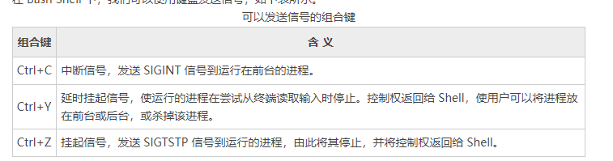

# Shell向进程发送信号（kill、pkill和killall命令）
我们可以使用键盘或者pkill命令、kill命令和killall命令向进程发送各种信号。

# 使用键盘发送信号
在Bash Shell下，我们可以使用键盘发送信号，如下表所示


# kill命令发送信号
大多数主流的Shell，包括Bash，都有内置的kill命令。Linux系统中，也有kill命令，即/bin/kill。如果使用/bin/kill，则系统可能会激活一些额外的选项，
比如，杀掉不是你自己的进程，或指定进程名作为参数，类似于pgrep和pkill命令。不过两种kill命令默认都是发送SIGTERM信号。

当准备杀掉一个进程或者是一连串的进程时，我们的常识是从尝试发送最安全的信号开始，也就是SIGTERM信号。以这种方式关闭正常停止运行的程序，当它收到SIGTERM信号时，
有机会按照已经设计好的流程执行，比如，清理和关闭打开的文件。

如果你发送一个SIGKILL信号到进程，你将消除进程先清理而后关闭的机会，而这可能会导致不幸的结果。但如果一个有序的终结不管用，那么发送SIGINT或SIGKILL信号可能就是唯一的方法了。
例如，当一个前台进程使用Ctrl+C组合键杀不掉的时候，那最好就使用命令`kill -9 PID`了

在前面的学习中我们已经了解，kill 命令可以发送多种信号到进程。特别有用的信号包括：
+ SIGHUP (1)
+ SIGINT (2)
+ SIGKILL (9)
+ SIGCONT (18)
+ SIGSTOP (19)

在 Bash Shell 中，信号名或信号值都可作为 kill 命令的选项，而作业号或进程号则作为 kill 命令的参数。

**实例1**

发送 SIGKILL 信号到 PID 是 123 的进程。
```shell
kill -9 123
```
或是：
```shell
kill -KILL 123
```
也可以是：
```shell
kill -SIGKILL 123
```

**实例2**

使用 kill 命令终结一个作业。
```shell
# 将sleep命令放在后台执行，休眠60s
[root@zntsa 16.Linux进程简明教程]# sleep 60 &
[3] 30755
[2]   Done                    sleep 10

# 列出当前Shell下的所有作业信息
[root@zntsa 16.Linux进程简明教程]# jobs -l
[3]+ 30755 Running                 sleep 60 &

# 终结作业3
[root@zntsa 16.Linux进程简明教程]# kill %3
[3]+  Terminated              sleep 60

# 查看当前Shell中的所有作业信息
[root@zntsa 16.Linux进程简明教程]# jobs -l
```

# killall 命令发送信号
killall命令会发送信号到运行任何指定命令的所有进程。所以，当一个进程启动了多个实例时，使用killall命令来杀掉这些进程会更方便些。

> 注意：在生产环境中，若没有经验，使用 killall 命令之前请先测试该命令，因为在一些商业 Unix 系统中，它可能不像所期望的那样工作。

如果没有指定信号名，killall 命令会默认发送 SIGTERM 信号。例如，使用 killall 命令杀掉所有 firefox 进程：
```shell
killall firefox
```
发送 KILL 信号到 firefox 的进程：
```shell
killall -s SIGKILL firefox
```

# pkill 命令发送信号
使用pkill命令，可以通过指定进程名、用户名、组名、终端、UID、EUID和GID等属性来杀掉相应的进程。pkill命令默认也是发送SIGTERM信号到进程。

**实例1**

使用pkill命令杀掉所有用户的firefox进程
```shell
pkill firefox
```

**实例2**

强制杀掉用户moziyan的firefox进程
```shell
pkill -KILL -u moziyan firefox
```

**实例3**

让sshd守护进程重新加载它的配置文件
```shell
pkill -HUP sshd
```

