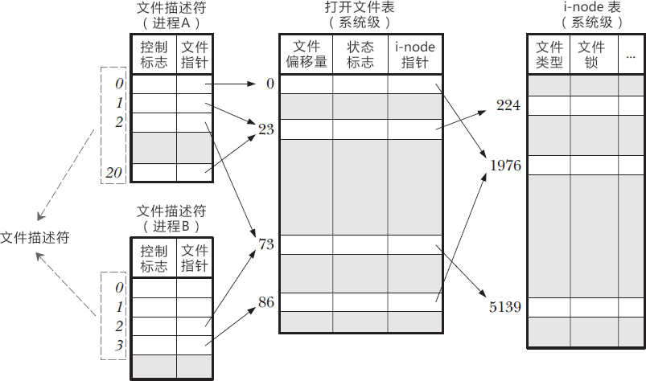

# Linux中的文件描述符到底是什么？
Linux中，一切皆是文件，比如C++源文件、视频文件、Shell脚本、可执行文件等，就连键盘、显示器、鼠标等硬件设备也都是文件。

一个 Linux 进程可以打开成百上千个文件，为了表示和区分已经打开的文件，Linux 会给每个文件分配一个编号（一个 ID），这个编号就是一个整数，
被称为**文件描述符（File Descriptor）**。

这只是一个形象的比喻，为了让读者容易理解我才这么说。如果你也仅仅理解到这个层面，那不过是浅尝辄止而已，并没有看到文件描述符的本质。

# Linux 文件描述符到底是什么？
一个 Linux 进程启动后，会在内核空间中创建一个 PCB 控制块，PCB 内部有一个文件描述符表（File descriptor table），记录着当前进程所有可用的文件描述符，也即当前进程所有打开的文件。

> 内核空间是虚拟地址空间的一部分，想死磕的读者请猛击《C语言内存精讲》，不想纠缠细节的读者可以这样理解：进程启动后要占用内存，
> 其中一部分内存分配给了文件描述符表。

除了文件描述符表，系统还需要维护另外两张表：
+ 打开文件表（Open file table）
+ i-node 表（i-node table）

文件描述符表每个进程都有一个，打开文件表和 i-node 表整个系统只有一个，它们三者之间的关系如下图所示。

从本质上讲，这三种表都是结构体数组，0、1、2、73、1976 等都是数组下标。表头只是我自己添加的注释，数组本身是没有的。实线箭头表示指针的指向，虚线箭头是我自己添加的注释。

你看，文件描述符只不过是一个数组下标吗！

通过文件描述符，可以找到文件指针，从而进入打开文件表。该表存储了以下信息：
+ 文件偏移量，也就是文件内部指针偏移量。调用 read() 或者 write() 函数时，文件偏移量会自动更新，当然也可以使用 lseek() 直接修改。
+ 状态标志，比如只读模式、读写模式、追加模式、覆盖模式等。
+ i-node 表指针。

然而，要想真正读写文件，还得通过打开文件表的 i-node 指针进入 i-node 表，该表包含了诸如以下的信息：
+ 文件类型，例如常规文件、套接字或 FIFO。
+ 文件大小。
+ 时间戳，比如创建时间、更新时间。
+ 文件锁。

对上图的进一步说明：
+ 在进程 A 中，文件描述符 1 和 20 都指向了同一个打开文件表项，标号为 23（指向了打开文件表中下标为 23 的数组元素），这可能是通过调用 dup()、dup2()、fcntl() 或者对同一个文件多次调用了 open() 函数形成的。
+ 进程 A 的文件描述符 2 和进程 B 的文件描述符 2 都指向了同一个文件，这可能是在调用 fork() 后出现的（即进程 A、B 是父子进程关系），或者是不同的进程独自去调用 open() 函数打开了同一个文件，此时进程内部的描述符正好分配到与其他进程打开该文件的描述符一样。
+ 进程 A 的描述符 0 和进程 B 的描述符 3 分别指向不同的打开文件表项，但这些表项均指向 i-node 表的同一个条目（标号为 1976）；换言之，它们指向了同一个文件。发生这种情况是因为每个进程各自对同一个文件发起了 open() 调用。同一个进程两次打开同一个文件，也会发生类似情况。 

有了以上对文件描述符的认知，我们很容易理解以下情形：
+ 同一个进程的不同文件描述符可以指向同一个文件；
+ 不同进程可以拥有相同的文件描述符；
+ 不同进程的同一个文件描述符可以指向不同的文件（一般也是这样，除了 0、1、2 这三个特殊的文件）；
+ 不同进程的不同文件描述符也可以指向同一个文件。