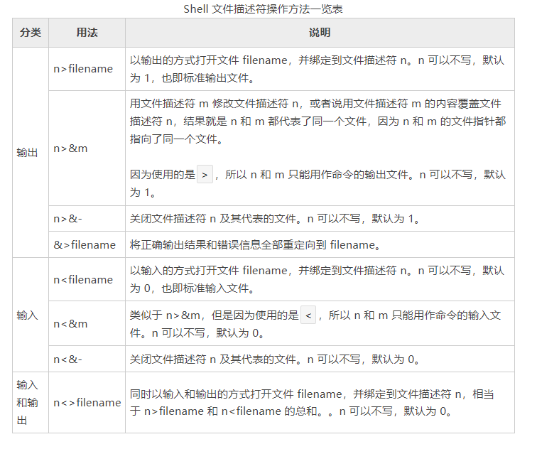

# 结合文件描述符谈重定向，彻底理解重定向的本质！
之前的《Linux重定向》讲解了输入输出重定向的各种写法，并提到了文件描述符的概念；《Linux文件描述符》一节，从底层剖析了文件描述符的本质，它只不过是一个数组下标。
本节我们就将两者结合起来，看看 Shell 是如何借助文件描述符实现重定向的。

Linux系统在每次读写文件的时候，都会从文件描述符下手，通过文件描述符找到文件指针，然后进入打开文件表和i-node表，这两个表里才真正保存了与打开文件相关的各种信息。

试想一下，如果我们改变了文件指针的指向，不就改变了文件描述符对应的真实文件了么。比如文件描述符1本来对应的是显示器，但是我们偷偷将文件指针指向了log.txt，
那么文件描述符1也就和log.txt对应起来了。

文件指针只不过是一个内存地址，修改它是轻而易举的事情。文件指针是文件描述符和真实文件之间最关键点的“纽带”，然而这条纽带却非常脆弱，很容易被修改。

Linux 系统提供的函数可以修改文件指针，比如 dup()、dup2()；Shell 也能修改文件指针，输入输出重定向就是这么干的。

输入输出重定向就是通过修改文件指针来实现的！更准确地说，发生重定向时，Linux会用文件描述符表（一个结构体数组）中的一个元素给另一个元素赋值，或者用一个结构体变量给数组元素赋值，
整体上的资源开销相当低。

发生重定向的时候，文件描述符并没有改变，改变的是文件描述符对应的文件指针。对于标准输出，Linux 系统始终向文件描述符 1 中输出内容，而不管它的文件指针指向哪里；只要我们修改了文件指针，就能向任意文件中输出内容。

以下面的语句为例来说明：
```shell
echo "c.biancheng.net" 1>log.txt
```

文件描述符表本质上是一个结构体数组，假设这个结构体的名字叫做FD。发生重定向时，Linux系统首先会打开log.txt文件，并把各种信息添加到i-node表和文件打开表，
然后再创建一个FD变量（通过这个变量其实就能读写文件了），并用这个变量给下标为 1 的数组元素赋值，覆盖原来的内容，这样就改变了文件指针的指向，完成了重定向。

# Shell 对文件描述符的操作
前面提到，`>`是输出重定向符号，`<`是输入重定向符号；更准确的说，它们应该叫做文件描述符操作符。>和<通过修改文件操作符改变了文件指针的指向，所以能够实现重定向的功能。

除了>和<，Shell还支持`<>`，它的效果是前两者的总和



【实例1】前面的文章中提到了下面这种用法：
```shell
command >file 2>&1
```
它省略了文件描述符1，所以其实它等价于：
```shell
command 1>file 2>&1
```
这个语句可以分成两步：先执行`1>file`，让文件描述符 1 指向 file；再执行`2>&1`，用文件描述符 1 修改文件描述符 2，让 2 和 1 的内容一样。
最终 1 和 2 都指向了同一个文件，也就是 file。所以不管是向 1 还是向 2 中输出内容，最终都输出到 file 文件中。

这里需要注意执行顺序，多个操作符在一起会从左往右依次执行。对于上面的语句，就是先执行`1>file`，再执行`2>&1`；如果写作下面的形式，那就南辕北辙了：
```shell
command 2>&1 1>file
```
这时，Shell会先执行`2>&1`也就是把错误输出指向了标准输出，此时1和2都指向了标准输出文件，也就是显示器；接着执行`1>file`，这样1就指向了file文件，
但是2还是指向显示器。最终的结果是，正确的输出结果输出到了file文件，错误信息却还是输出到显示器。

【实例2】一个比较奇葩的重定向写法。
```shell
echo "C语言中文网" 10>log.txt >&10
```
先执行`10>log.txt`，打开 log.txt，并给它分配文件描述符 10；接着执行`>&10`，用文件描述符 10 来修改文件描述符 1（对于`>`，省略不写的话默认为 1），
让 1 和 10 都指向 log.txt 文件，最终的结果是向 log.txt 文件中输出内容。

这条语句其实等价于`echo "C语言中文网" >log.txt`，我之所以写得这么绕，是为了让大家理解各种操作符的用法。

文件描述符 10 只用了一次，我们在末尾最好将它关闭，这是一个好习惯。
```shell
echo "C语言中文网" 10>log.txt >&10 10>&-
```

