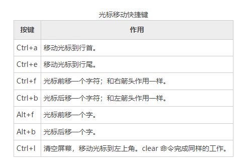
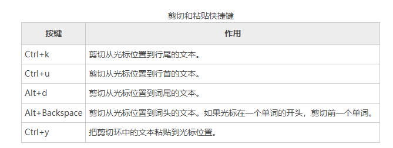

# Bash Shell快捷键大全

# 命令行编辑
Bash Shell使用了一个名为Readline的库（共享的线程集合，可以被不同的程序使用），来实现命令行编辑。我们已经看到一些例子。我们知道，
例如，箭头按键可以移动鼠标，此外还有许多特性。想想这些额外的工具，我们可以在工作中使用。学会所有的特性并不重要，但许多特性非常有帮助。选择自己需要的特性。

> 注意：下面一些按键组合（尤其使用 Alt 键的组合），可能会被 GUI 拦截来触发其它的功能。当使用虚拟控制台时，所有的按键组合都应该正确地工作。

# 移动光标
下表列出了移动光标所使用的按键。

# 修改文本
下面这些快捷键用来在命令行中编辑字符。

# 剪切和粘贴文本
Readline 的文档使用术语 killing 和 yanking 来指我们平常所说的剪切和粘贴。剪切下来的本文被存储在一个叫做剪切环（kill-ring）的缓冲区中。

# 【冷知识】元键

如果你冒险进入到 Readline 的文档中，你会在 bash 手册页的 READLINE 段落，遇到一个术语“元键（meta key）”。在当今的键盘上，
这个元键是指 Alt 键，但并不总是这样。

回到昏暗的年代（在PC 之前Unix 之后），并不是每个人都有他们自己的计算机。他们可能有一个叫做终端的设备。一个终端是一种通信设备，
它以一个文本显示屏幕和一个键盘作为其特色，它里面有足够的电子器件来显示文本字符和移动光标。它连接到（通常通过串行电缆）一个更大的计算机或者是一个大型计算机的通信网络。

有许多不同的终端产品商标，它们有着不同的键盘和特征显示集。因为它们都倾向于至少能理解 ASCII，所以软件开发者想要符合最低标准的可移植的应用程序。
Unix 系统有一个非常精巧的方法来处理各种终端产品和它们不同的显示特征。

因为 Readline 程序的开发者们，不能确定一个专用多余的控制键的存在，他们发明了一个控制键，并把它做“元（meta）”。然而在现代的键盘上，Alt 键作为元键来服务。
如果你仍然在使用终端（在 Linux 中，你仍然可以得到一个终端），你也可以按下和释放 Esc 键来得到如控制 Alt 键一样的效果。