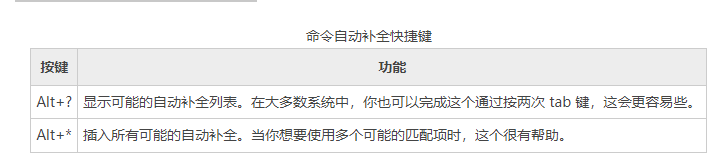

# Bash Shell命令自动补全功能
shell 能帮助你的另一种方式是通过一种叫做自动补全的机制。当你敲入一个命令时，按下 tab 键，自动补全就会发生。

让我们看一下这是怎样工作的。给出一个看起来像这样的主目录：
```shell
[c.biancheng.net]$ ls
Desktop ls-output.txt Pictures Templates Videos
....
```
试着输入下面的命令，但不要按下Enter 键：
```shell
[c.biancheng.net]$ ls l
```
现在按下tab 键：
```shell
[c.biancheng.net]$ ls ls-output.txt
```
看一下shell 是怎样补全这一行的？让我们再试试另一个例子。这回，也不要按下Enter：
```shell
[c.biancheng.net]$ ls D
```
按下 tab：
```shell
[c.biancheng.net]$ ls D
```
没有补全，只是嘟嘟响。因为“D” 不止匹配目录中的一个条目。为了自动补全执行成功，你给它的“线索” 必须不模棱两可。如果我们继续输入：
```shell
[c.biancheng.net]$ ls Do
```
然后按下tab：
```shell
[c.biancheng.net]$ ls Documents
```
自动补全成功了。

这个实例展示了路径名自动补全，这是最常用的形式。自动补全也能对变量起作用（如果字的开头是一个“$”），用户名字（单词以”” 开始），
命令（如果单词是一行的第一个单词），和主机名（如果单词的开头是“@”）。主机名自动补全只对包含在文件 /etc/hosts 中的主机名有效。

有一系列的快捷键与自动补全相关联：



# 可编程自动补全

目前的 bash 版本有一个叫做可编程自动补全工具。可编程自动补全允许你（更可能是，你的发行版提供商）来加入额外的自动补全规则。通常需要加入对特定应用程序的支持，
来完成这个任务。例如，有可能为一个命令的选项列表，或者一个应用程序支持的特殊文件类型加入自动补全。

默认情况下，Ubuntu 已经定义了一个相当大的规则集合。可编程自动补全是由 shell 函数实现的。

如果你感到好奇，试一下：
```shell
set | less
```
查看一下如果你能找到它们的话。默认情况下，并不是所有的发行版都包括它们。
