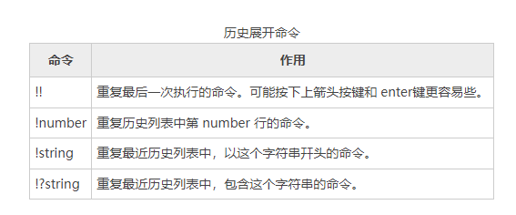

# Shell history：历史命令

bash shell维护着一个已经执行过的命令的历史列表。这个命令列表被保存在你的主目录下，一个叫做.bash_history的文件里。这个history工具是个有用的资源，
因为它可以减少你敲键盘的次数，尤其当和命令行编辑联系起来时。

# 搜索历史命令
在任何时候，我们都可以浏览历史列表的内容，通过：
```shell
[c.biancheng.net]$ history | less
```
在默认情况下，bash 会存储你所输入的最后 500 个命令。在随后的章节里，我们会知道怎样调整这个数值。

比方说我们想要找到列出目录 /usr/bin 内容的命令。一种方法，我们可以这样做：
```shell
[c.biancheng.net]$ history | grep /usr/bin
```
比方说在我们的搜索结果之中，我们得到一行，包含了有趣的命令，像这样：
```shell
88 ls -l /usr/bin > ls-output.txt
```
数字“88” 是这个命令在历史列表中的行号。随后在使用另一种展开类型时，叫做历史命令展开，我们会用到这个数字。我们可以这样做，来使用我们所发现的行：
```shell
[c.biancheng.net]$ !88
```
bash 会把“!88” 展开成为历史列表中 88 行的内容。还有其它的历史命令展开形式，我们一会儿讨论它们。

bash 也具有按递增顺序来搜索历史列表的能力。这意味着随着字符的输入，我们可以告诉 bash 去搜索历史列表，每一个附加字符都进一步提炼我们的搜索。

启动递增搜索，输入Ctrl+r，其后输入你要寻找的文本。当你找到它以后，你可以敲入 Enter 来执行命令，或者输入 Ctrl+j，从历史列表中复制这一行到当前命令行。再次输入 Ctrl+r，来找到下一个匹配项（向上移动历史列表）。

输入 Ctrl+g 或者 Ctrl+c，退出搜索，实际来体验一下：
```shell
[c.biancheng.net]$
```
首先输入 Ctrl+r：
```shell
(reverse-i-search)`':
```
提示符改变，显示我们正在执行反向递增搜索。搜索过程是“反向的”，因为我们按照从”现在” 到过去某个时间段的顺序来搜寻。下一步，我们开始输入要查找的文本。
在这个例子里是“tcpreplay -i enp”：
```shell
(reverse-i-search)`tcpreplay -i enp': tcpreplay -i enp10s0 -K -M 50 test_packets/danger/*.pcap
```
即刻，搜索返回我们需要的结果。我们可以执行这个命令，按下 Enter 键，或者我们可以复制这个命令到我们当前的命令行，来进一步编辑它，输入 Ctrl+j。

复制它，输入Ctrl+j：
```shell
[root@zntsa ~]# tcpreplay -i enp10s0 -K -M 50 test_packets/danger/*.pcap
```
我们的 shell 提示符重新出现，命令行加载完毕，正准备行动！下表列出了一些按键组合，这些按键用来操作历史列表。


# 历史命令展开
通过使用`!`字符，shell 为历史列表中的命令，提供了一个特殊的展开类型。我们已经知道一个感叹号，其后再加上一个数字，可以把来自历史列表中的命令插入到命令行中。
还有一些其它的展开特性：



应该小心谨慎地使用“!string” 和“!?string” 格式，除非你完全确信历史列表条目的内容。

在历史展开机制中，还有许多可利用的特点，但是这个题目已经太晦涩难懂了，如果我们再继续讨论的话，我们的头可能要爆炸了。
bash 手册页的 HISTORY EXPANSION 部分详尽地讲述了所有要素。

# 扩展阅读
除了 bash 中的命令历史特性，许多 Linux 发行版包括一个叫做 script 的程序，这个程序可以记录整个 shell 会话，并把 shell 会话存在一个文件里面。
这个命令的基本语法是：
```shell
script [file]
```
命令中的 file 是指用来存储 shell 会话记录的文件名。如果没有指定文件名，则使用文件 typescript。查看脚本的手册页，
可以得到一个关于 script 程序选项和特点的完整列表。

