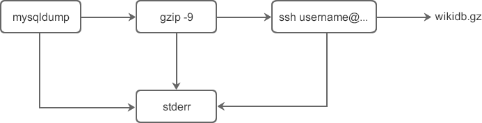

# Linux Shell管道详解
之前，我们学习了从文件重定向输入，以及重定向输出到文件。Shell还有一种功能，就是可以将两个或者多个命令（程序或者进程）连接到一起，把一个命令额度输出作为下一个命令的输入，
以这种方式连接的两个或者多个命令就形成了管道（pipe）

Linux管道使用`|`连接多个命令，这被称为管道符。Linux管道的具体语法格式如下：
```shell
command1|command2
command1 | command2 [ | commandN... ]
```
当在两个命令之间设置管道时，管道符`|`左边命令的输出就变成了右边命令的输入。只要第一个命令向标准输出写入，而第二个命令是从标准输入读取，
那么这两个命令就可以形成一个管道。大部分的 Linux 命令都可以用来形成管道。

> 这里需要注意，command1必须有正确的输出，而command2必须可以处理command1的输出结果；而且 command2 只能处理 command1 的正确输出结果，
> 不能处理 command1 的错误信息。

# 为什么使用管道
我们先看下面一组命令，使用 mysqldump（一个数据库备份程序）来备份一个叫做 wiki 的数据库：
```shell
mysqldump -u root -p '123456' wiki > /tmp/wikidb.backup
gzip -9 /tmp/wikidb.backup
scp /tmp/wikidb.backup username@remote_ip:/backup/mysql/
```
上述这组命令主要做了如下任务：
+ mysqldump 命令用于将名为 wike 的数据库备份到文件 /tmp/wikidb.backup；其中-u和-p选项分别指出数据库的用户名和密码。
+ gzip 命令用于压缩较大的数据库文件以节省磁盘空间；其中-9表示最慢的压缩速度最好的压缩效果。
+ scp 命令（secure copy，安全拷贝）用于将数据库备份文件复制到 IP 地址为 remote_ip 的备份服务器的 /backup/mysql/ 目录下。其中`username`是登录远程服务器的用户名，命令执行后需要输入密码。

上述三个命令依次执行。然而，如果使用管道的话，你就可以将 mysqldump、gzip、ssh 命令相连接，这样就避免了创建临时文件 /tmp/wikidb.backup，而且可以同时执行这些命令并达到相同的效果。

使用管道后的命令如下所示：
```shell
mysqldump -u root -p '123456' wiki | gzip -9 | ssh username@remote_ip "cat > /backup/wikidb.gz"
```
这些使用了管道的命令有如下特点：
+ 命令的语法紧凑并且使用简单。
+ 通过使用管道，将三个命令串联到一起就完成了远程 mysql 备份的复杂任务。
+ 从管道输出的标准错误会混合到一起。

上述命令的数据流如下图所示：


# 重定向和管道的区别
乍看起来，管道也有重定向的作用，它也改变了数据输入输出的方向，那么，管道和重定向之间到底有什么不同呢？

简单地说，重定向操作符>将命令与文件连接起来，用文件来接收命令的输出；而管道符|将命令与命令连接起来，用第二个命令来接收第一个命令的输出。如下所示：

```shell
command > file
command |command1
```
有些读者在学习管道时会尝试如下的命令，我们来看一下会发生什么：
```shell
command1 > command2
```
答案是，有时尝试的结果将会很糟糕。这是一个实际的例子，一个 Linux 系统管理员以超级用户（root 用户）的身份执行了如下命令：
```shell
cd /usr/bin
ls > less
```
第一条命令将当前目录切换到了大多数程序所存放的目录，第二条命令是告诉 Shell 用 ls 命令的输出重写文件 less。因为 /usr/bin 目录已经包含了名称为 less（less 程序）的文件，
第二条命令用 ls 输出的文本重写了 less 程序，因此破坏了文件系统中的 less 程序。

这是使用重定向操作符错误重写文件的一个教训，所以在使用它时要谨慎。

# Linux管道实例
【实例1】将ls命令的输出发送到grep命令
```shell
[root@zntsa ~]# ls | grep log.txt
log.txt
```
上述命令是查看文件 log.txt 是否存在于当前目录下。

我们可以在命令的后面使用选项，例如使用-al选项：
```shell
[root@zntsa ~]# ls -al | grep log.txt
-rw-r--r--   1 root    root              5 Apr 24 10:13 log.txt
```
管道符`|`与两侧的命令之间也可以不存在空格，例如将上述命令写成`ls -al|grep log.txt`；然而还是推荐在`|`两侧加上空格，提高代码的可读性。

我们也可以重定向管道的输出到一个文件，比如将上述管道命令的输出结果发送到文件 output.txt 中：
```shell
[root@zntsa ~]# ls -al | grep log.txt >output.txt
[root@zntsa ~]# cat output.txt 
-rw-r--r--   1 root    root              5 Apr 24 10:13 log.txt
```
【实例2】使用管道将 cat 命令的输出作为 less 命令的输入，这样就可以将 cat 命令的输出每次按照一个屏幕的长度显示，这对于查看长度大于一个屏幕的文件内容很有帮助。
```shell
cat /var/log/message | less
```
【实例3】查看指定程序的进程运行状态，并将输出重定向到文件中。
```shell
[c.biancheng.net]$ ps aux | grep httpd > /tmp/ps.output
[c.biancheng.net]$ cat /tem/ps.output
mozhiyan  4101     13776  0   10:11 pts/3  00:00:00 grep httpd
root      4578     1      0   Dec09 ?      00:00:00 /usr/sbin/httpd
apache    19984    4578   0   Dec29 ?      00:00:00 /usr/sbin/httpd
apache    19985    4578   0   Dec29 ?      00:00:00 /usr/sbin/httpd
apache    19986    4578   0   Dec29 ?      00:00:00 /usr/sbin/httpd
apache    19987    4578   0   Dec29 ?      00:00:00 /usr/sbin/httpd
apache    19988    4578   0   Dec29 ?      00:00:00 /usr/sbin/httpd
apache    19989    4578   0   Dec29 ?      00:00:00 /usr/sbin/httpd
apache    19990    4578   0   Dec29 ?      00:00:00 /usr/sbin/httpd
apache    19991    4578   0   Dec29 ?      00:00:00 /usr/sbin/httpd
```
【实例4】显示按用户名排序后的当前登录系统的用户的信息。
```shell
[c.biancheng.net]$ who | sort
mozhiyan :0           2019-04-16 12:55 (:0)
mozhiyan pts/0        2019-04-16 13:16 (:0)
```
who 命令的输出将作为 sort 命令的输入，所以这两个命令通过管道连接后会显示按照用户名排序的已登录用户的信息。

【实例5】统计系统中当前登录的用户数。
```shell
[c.biancheng.net]$ who | wc -l
5
```
# 管道与输入重定向
输入重定向操作符<可以在管道中使用，以用来从文件中获取输入，其语法类似下面这样：
```shell
command1 < input.txt | command2
command1 < input.txt | command2 -option | command3
```
例如，使用 tr 命令从 os.txt 文件中获取输入，然后通过管道将输出发送给 sort 或 uniq 等命令：
```shell
[c.biancheng.net]$ cat os.txt
redhat
suse
centos
ubuntu
solaris
hp-ux
fedora
centos
redhat
hp-ux
[c.biancheng.net]$ tr a-z A-Z <os.txt | sort
CENTOS
CENTOS
FEDORA
HP-UX
HP-UX
REDHAT
REDHAT
SOLARIS
SUSE
UBUNTU
[c.biancheng.net]$ tr a-z A-Z <os.txt | sort | uniq
CENTOS
FEDORA
HP-UX
REDHAT
SOLARIS
SUSE
UBUNTU
```
# 管道与输出重定向
你也可以使用重定向操作符>或>>将管道中的最后一个命令的标准输出进行重定向，其语法如下所示：
```shell
command1 | command2 | ... | commandN > output.txt
command1 < input.txt | command2 | ... | commandN > output.txt
```
【实例1】使用 mount 命令显示当前挂载的文件系统的信息，并使用 column 命令格式化列的输出，最后将输出结果保存到一个文件中。
```shell
[c.biancheng.net]$ mount | column -t >mounted.txt
[c.biancheng.net]$ cat mounted.txt
proc         on  /proc                  type  proc        (rw,nosuid,nodev,noexec,relatime)
sysfs        on  /sys                   type  sysfs       (rw,nosuid,nodev,noexec,relatime,seclabel)
devtmpfs     on  /dev                   type  devtmpfs    (rw,nosuid,seclabel,size=496136k,nr_inodes=124034,mode=755)
securityfs   on  /sys/kernel/security   type  securityfs  (rw,nosuid,nodev,noexec,relatime)
tmpfs        on  /dev/shm               type  tmpfs       (rw,nosuid,nodev,seclabel)
devpts       on  /dev/pts               type  devpts      (rw,nosuid,noexec,relatime,seclabel,gid=5,mode=620,ptmxmode=000)
tmpfs        on  /run                   type  tmpfs       (rw,nosuid,nodev,seclabel,mode=755)
tmpfs        on  /sys/fs/cgroup         type  tmpfs       (rw,nosuid,nodev,noexec,seclabel,mode=755)
#####此处省略部分内容#####
```
【实例2】使用 tr 命令将 os.txt 文件中的内容转化为大写，并使用 sort 命令将内容排序，使用 uniq 命令去除重复的行，最后将输出重定向到文件 ox.txt.new。
```shell
[c.biancheng.net]$ cat os.txt
redhat
suse
centos
ubuntu
solaris
hp-ux
fedora
centos
redhat
hp-ux
[c.biancheng.net]$ tr a-z A-Z <os.txt | sort | uniq >os.txt.new
[c.biancheng.net]$ cat os.txt.new
CENTOS
FEDORA
HP-UX
REDHAT
SOLARIS
SUSE
UBUNTU
```